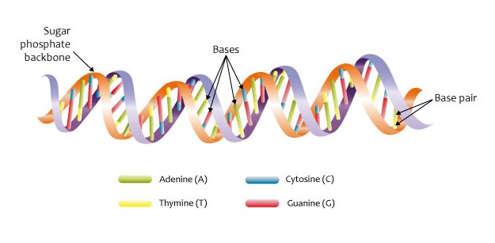

# 🧬 Computational Biology & Cellular Automata Project

Welcome to an integrated project exploring **computational biology**, **multi-omics data modeling**, and **cellular automata (CA)** simulations across various biological systems. This repository includes theoretical foundations, problem-solving scripts, and simulation engines for genomics, nephrology, and personalized Ayurveda.

<p align="center">
  
  <br/>
  <em>DNA Made Simple: A Visual Guide for Everyone</em>
</p>

---

## 📁 Project Structure

```
├── background/                   # Theory and reference documents
├── agentic_cellular_automata/    # Building intelligent cellular automata with less effort with agentic AI
├── biology_with_e/               # Relating e (the exponential constant) with biology
├── cellular_automata/            # CA-based simulations in bio systems
├── collaborative_filtering/      # Recovering missing dinosaur DNA with collaborative filtering
├── genomics_coding_problems/     # Python-based coding challenges in genomics
├── genomics_database/            # A relational DB schema for storing genomics and querying insights
├── metabolomics_database/        # A relational DB schema for storing metabolomics data aligned with Ayurvedic concepts
├── quantum_neuron/               # Modelling a biological neuron by using concepts from quantum computing
└── README.md                     # You're here!
```

---

## 📚 1. Background => `/background`

This section provides theoretical foundations and algorithmic guides for understanding computational biology.

### Files:
- `cellular_automata_basics.md`  
  Intro to basic concepts of cellular automata for computational applications.

- `computational_biology_basic_concepts.md`  
  Intro to molecular biology concepts for computational applications.

- `computational_biology_io_file_formats.md`  
  Overview of key bioinformatics file formats like FASTA, FASTQ, VCF, etc.

- `profile_matrix_and_motif_search_algorithms.md`  
  Detailed explanation of motif search strategies (used in `genomics_coding_problems`).

---

## 🧬 2. Genomics Coding Problems => `/genomics_coding_problems`

Python scripts solving practical problems in genomics. Ideal for hands-on practice, assignments, or interviews.

### Topics Include:
- Motif finding, profile matrix, consensus sequence
- Hamming distance, reverse complements
- Randomized, Greedy, Gibbs Sampling, EM motif search

### Quick Start:
```bash
cd genomics_coding_problems
python 01_count_motif_occurances.py
```

Each file is self-contained and documented.

---

## 🧪 3. Cellular Automata Applications => `/cellular_automata`

Using CA to simulate and model biological systems in various domains.

### Modules:

#### 🔬 `multi_omics/`
Simulates biological systems using omics data (genomics, proteomics, metabolomics).
- `automaton.py` — Core CA logic
- `data/*.csv` — Omics datasets
- `README.md` — Documentation

#### 🧫 `nephrons/`
Simulates nephron behavior using CA.
- `simulating_nephrons.py`
- `README.md`

#### 🌿 `personalized_ayurveda/`
Models Ayurvedic medicine personalization with CA logic.
- `ayurvedic_ca.py`
- `README.md`

---

## 💥 4. Cellular Automata with Agentic AI => `/agentic_cellular_automata`
Core logic and experiments to combine intelligent AI agent behaviors with cellular automata models leading to realistic biological behaviour by leveraging `emergence`.

---

## 🧩 5. Biology versus e => `/biology_with_e`
An insightful discussion on why every biological system has a tightly coupled relationship with e (the exponential component).

---

## 🦕 6. Discovering Dino DNA => `/collaborative_filtering`
An attempt to discover missing dinosaur DNA sequences by cross-application of collaborative filtering (inspired by recommender systems) to genomics.

---

## 🧬 7. Genomics DB => `/genomics_database`
An attempt to implement a relational DB schema for storing, retrieving, and managing genomics-related datasets.

---

## 🎯 8. Personalized Metabolomics => `/metabolomics_database`
An attempt to implement a personalized metabolomics DB schema with Ayurvedic concepts for:
  - storing, retrieving, and managing metabolomics-related datasets
  - calculating the personalized Ayurvedic profile of each individual over time 

---

## 🔮 9. Quantum Neuron => `/quantum_neuron`
An attempt to implement a quantum neuron (by leveraging core concepts of quantum computing) to simulate the actual behaviour of a biological neuron (more realistic than the standard Turing neuron used in ANNs).

---

## 📄 License

MIT License.

---

## 🙌 Acknowledgements

Inspired by coursework in computational biology, synthetic biology modeling, and multi-omics data integration.

---

## 🔗 Related

- [Rosalind Coding Problems](http://rosalind.info/)
- [BioPython](https://biopython.org/)
- [NetLogo for CA](https://ccl.northwestern.edu/netlogo/)
