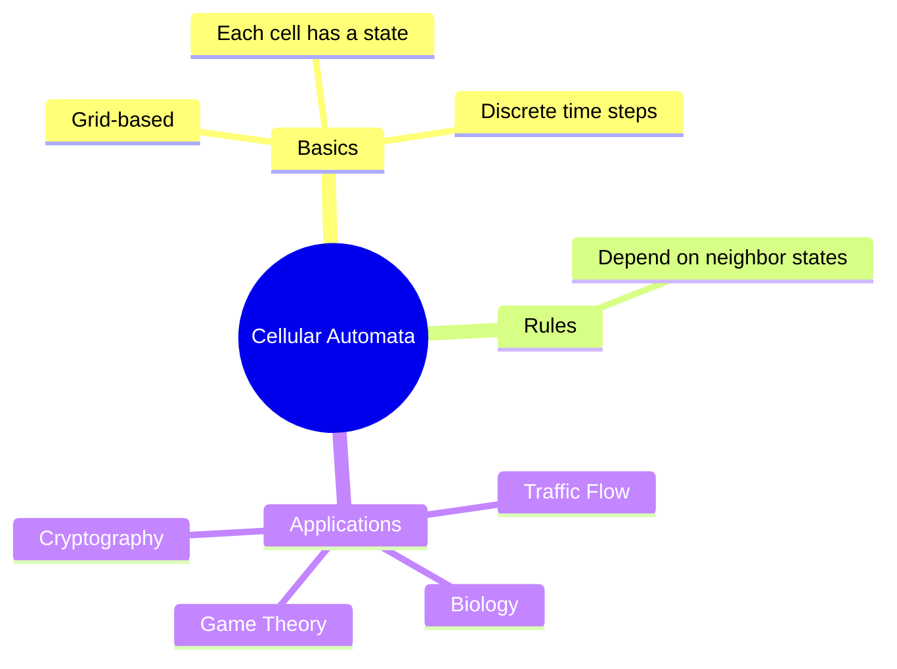
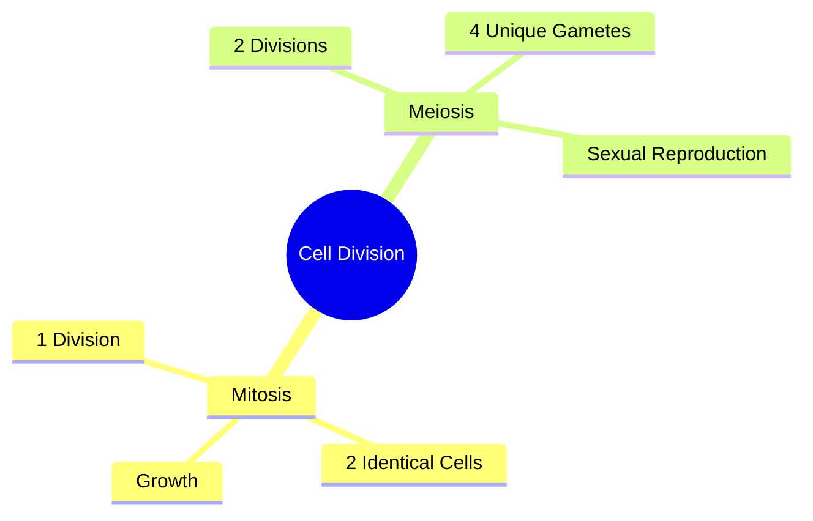

# 🧬 Cellular Automata and Cell Division – A Layman’s Guide

## What Are Cellular Automata?

Cellular Automata (CA) are simple models made of grids (like pixels) where each cell (in biological or non-biological context) changes over time based on rules and the state of neighboring cells.

Imagine a checkerboard. Each square (cell) is either on or off (alive or dead). Every second (tick), the squares change based on what their neighbors are doing.

### 🧠 Visualizing the Concept



---

## 🧬 Mitosis vs Meiosis – How Biological Cells Divide

| Feature       | Mitosis                        | Meiosis                             |
|--------------|----------------------------------|-------------------------------------|
| Purpose       | Growth and repair               | Reproduction                         |
| Resulting Cells | 2 identical daughter cells      | 4 genetically unique gametes         |
| Division Rounds | 1                              | 2                                   |
| Occurs In     | Somatic (body) cells             | Germ (sex) cells                     |



---

## 🎮 Conway's Game of Life

**Created by John Conway**, this is a famous cellular automaton. Each cell on a grid is either **alive** or **dead** and evolves every tick based on **4 simple rules**:

1. Any live cell with fewer than 2 live neighbors dies (underpopulation).
2. Any live cell with 2 or 3 live neighbors lives on.
3. Any live cell with more than 3 live neighbors dies (overcrowding).
4. Any dead cell with exactly 3 live neighbors becomes alive (reproduction).

### Analogy to Human Body

| Conway’s Game of Life            | Human Cell Behavior                   |
|----------------------------------|----------------------------------------|
| Cells follow survival rules      | Biological cells follow genetic signals|
| Overcrowding = death             | Cancer or apoptosis                    |
| Reproduction with 3 neighbors    | Cell signaling to divide               |

---

## 🔁 Enhanced Mitosis Simulation – Modeling Genetic Signals & Cell Fate

We simulate:

| Concept                     | Simulated As                                     |
|----------------------------|--------------------------------------------------|
| Genetic Signals            | A secondary array affecting CA evolution         |
| Cancer / Apoptosis Control | Random mutations causing uncontrolled growth/death |
| Cell Signaling to Divide   | Rule-based growth triggered by neighborhood state |

### 🧪 Python Code Example

```python
import numpy as np
import matplotlib.pyplot as plt
from Bio.Seq import Seq

# Define base genetic sequence (1 row = 1 cell's DNA)
parent_dna = Seq("ATGCGTAC")

# Map DNA bases to activity (AT = active = 1, CG = inactive = 0)
def dna_to_activity(seq):
    return np.array([1 if base in "AT" else 0 for base in seq])

# Simulated genetic control signals: 1 = divide, -1 = apoptosis, 0 = stable
def get_genetic_signals(seq):
    return np.array([1 if base == "A" else -1 if base == "G" else 0 for base in seq])

# Evolve CA with genetic controls
def evolve(ca, signals, cancer_mutation_chance=0.05):
    new_ca = ca.copy()
    for i in range(1, len(ca) - 1):
        neighborhood = ca[i - 1:i + 2]
        signal = signals[i]

        if np.random.rand() < cancer_mutation_chance:
            new_ca[i] = 1  # mutation to active state (cancer-like)
        elif signal == -1:
            new_ca[i] = 0  # apoptosis
        elif signal == 1 and sum(neighborhood) >= 2:
            new_ca[i] = 1  # divide if enough active neighbors
        else:
            new_ca[i] = ca[i]  # otherwise stay the same
    return new_ca

# Simulate mitosis with control
def simulate_mitosis_ca(seq, steps=10):
    ca = dna_to_activity(seq)
    signals = get_genetic_signals(seq)
    history = [ca]
    for _ in range(steps):
        ca = evolve(ca, signals)
        history.append(ca)
    return np.array(history)

# Simulate
history = simulate_mitosis_ca(parent_dna, steps=15)

# Plot result
plt.figure(figsize=(10, 6))
plt.imshow(history, cmap="Greys", interpolation="nearest")
plt.title("Cellular Automaton with Genetic Signals\n(Mitosis, Cancer, Apoptosis, Division Control)")
plt.xlabel("Gene Index")
plt.ylabel("Time Step")
plt.grid(False)
plt.show()
```

---

## 🧬 New Biological Mapping

| Simulation Behavior                 | Biological Analogy                     |
|------------------------------------|----------------------------------------|
| `signal == 1` triggers division    | Cell signaling for growth              |
| `signal == -1` leads to 0 state    | Apoptosis (programmed cell death)      |
| Random 1 activation (mutation)     | Cancer-like behavior (uncontrolled growth) |
| Neighborhood-based survival        | Environmental fitness or crowding      |

---

## 📚 References

- [Conway’s Game of Life - Wikipedia](https://en.wikipedia.org/wiki/Conway%27s_Game_of_Life)
- [Biopython Documentation](https://biopython.org/wiki/Documentation)
- [Wolfram Cellular Automata](https://mathworld.wolfram.com/ElementaryCellularAutomaton.html)

---
