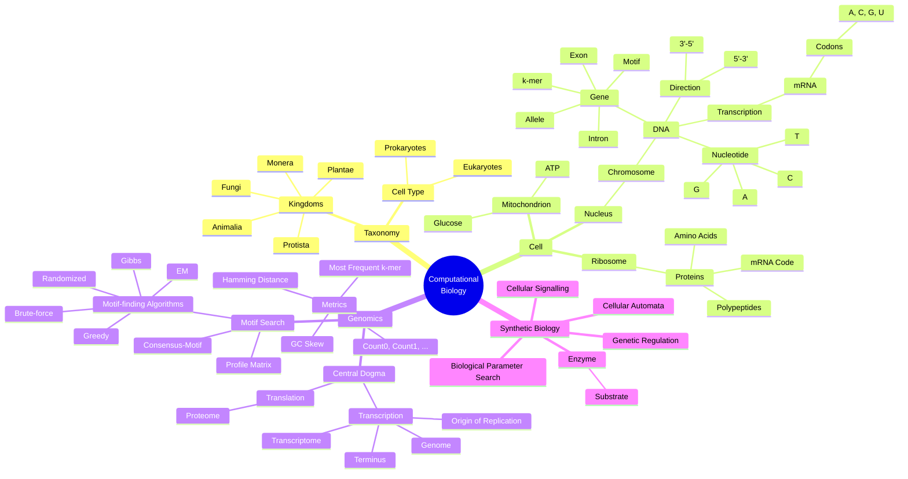

# 🧬 Layman's Cheatsheet for Computational Biology

## 🧠 Computational Biology Mindmap



## 🧬 Biology Concepts – Explained for Beginners

### 🏛️ The 5 Biological Kingdoms
| Kingdom    | Description |
|------------|-------------|
| **Animalia** | Multicellular organisms that move and consume organic material (e.g., humans, animals) |
| **Plantae**  | Multicellular, photosynthetic organisms (e.g., trees, flowers) |
| **Fungi**    | Organisms that absorb nutrients from surroundings (e.g., mushrooms, yeast) |
| **Protista** | Single-celled or simple multicellular organisms (e.g., algae, amoeba) |
| **Monera**   | Single-celled organisms without a nucleus (e.g., bacteria) |

### 🔬 Cell Types
- **Eukaryotes**: Have a **nucleus** and organelles (e.g., human cells)
- **Prokaryotes**: No nucleus; simpler cells (e.g., bacteria)

### 🧪 Cell Components
| Term          | Meaning |
|---------------|--------|
| **Cell**      | The smallest unit of life |
| **Nucleus**   | Contains DNA, the control center |
| **Mitochondrion** | Generates energy (ATP) |
| **Ribosome**  | Builds proteins from amino acids |
| **Chromosomes** | DNA-packed structures in the nucleus |

### 🧬 DNA, RNA, Proteins


| Term          | Meaning |
|---------------|--------|
| **DNA**       | Blueprint of life made of nucleotides (A, C, G, T) |
| **RNA (mRNA)**| Temporary copy of a DNA gene used to make proteins |
| **Protein**   | Molecules made of amino acids that do most cell work |
| **Amino Acids**| Building blocks of proteins |
| **Polypeptides**| Chains of amino acids (proteins) |
| **Nucleotide**| The letters of DNA/RNA (A, C, G, T for DNA; U for RNA) |
| **mRNA Code** | Set of instructions made of triplets of RNA bases (codons) |
| **A, C, G, T**| DNA bases: Adenine, Cytosine, Guanine, Thymine |
| **U**         | Uracil replaces Thymine in RNA |

### 🧬 Central Dogma of Genomics
```text
DNA → (Transcription) → mRNA → (Translation) → Protein
```

## 🧬 Closely-related Terms


| **Term**           | **What It Is**                                                | **Role in DNA/RNA/Protein**                                | **Size/Length**               | **Example or Analogy**                         |
|--------------------|---------------------------------------------------------------|--------------------------------------------------------------|-------------------------------|------------------------------------------------|
| **Nucleotide**     | The smallest unit of DNA/RNA (A, C, G, T/U)                   | Building blocks of DNA/RNA                                   | 1 base                        | Like a letter in a word                        |
| **Motif**          | A short, recurring pattern in DNA or proteins                 | Indicates biological function or regulation                  | Few bases/amino acids         | Like a common phrase in many sentences         |
| **Gene**           | A sequence of DNA that encodes a protein                      | Transcribed into mRNA, then translated to protein            | Hundreds to thousands of bases| Like a recipe in a cookbook                    |
| **Exon**           | The coding region of a gene                                   | Remains in mature mRNA after splicing                        | Varies                        | Like the important lines in a script           |
| **Intron**         | The non-coding region of a gene                               | Removed from pre-mRNA during splicing                        | Varies                        | Like footnotes you skip when reading           |
| **Promoter**       | A DNA sequence before a gene                                  | Initiates transcription by attracting RNA polymerase         | Dozens of bases               | Like a start signal in a race                  |
| **Codon**          | A sequence of 3 nucleotides                                   | Codes for a single amino acid in a protein                   | 3 bases                       | Like a word that translates to one item        |
| **Operon**         | A cluster of genes under one promoter (in prokaryotes)        | Allows coordinated gene expression                           | Several genes and promoter    | Like a power strip turning on several devices  |
| **Chromosome**     | A long DNA molecule with part or all of the genetic material  | Carries genes and regulatory elements                        | Millions of bases             | Like a volume in an encyclopedia               |
| **DNA**            | Double-stranded molecule of genetic code                      | Stores hereditary information                                | Billions of bases (humans)    | Like the complete blueprint required to print an encyclopedia set     |
| **mRNA**           | Messenger RNA transcribed from DNA                            | Carries instructions to make proteins                        | Varies (usually short-lived)  | Like a photocopy of a recipe to the kitchen    |
| **k-mer**          | A substring of DNA/RNA of length *k*                          | Used in sequence analysis and alignment                      | Exactly *k* bases             | Like a puzzle piece in a bigger picture        |
| **Allele**         | A version of a gene                                           | Contributes to variations in traits                          | Same gene location, varied sequence | Like different flavors of the same recipe  |
| **3'→5' direction**| Orientation of one strand of DNA/RNA                          | Template strand used during transcription                    | N/A                           | Like reading right-to-left in Arabic           |
| **5'→3' direction**| Direction of synthesis for DNA/RNA strands                    | RNA and DNA are built in this direction                      | N/A                           | Like reading left-to-right in English          |


## 🧬 Full mRNA Codon Table

Each codon (3 RNA letters) represents an **amino acid** or a **stop signal**.

| Codon | Amino Acid       | Codon | Amino Acid       | Codon | Amino Acid       | Codon | Amino Acid       |
|-------|------------------|-------|------------------|-------|------------------|-------|------------------|
| UUU   | Phenylalanine    | UCU   | Serine           | UAU   | Tyrosine         | UGU   | Cysteine         |
| UUC   | Phenylalanine    | UCC   | Serine           | UAC   | Tyrosine         | UGC   | Cysteine         |
| UUA   | Leucine          | UCA   | Serine           | UAA   | STOP             | UGA   | STOP             |
| UUG   | Leucine          | UCG   | Serine           | UAG   | STOP             | UGG   | Tryptophan       |
| CUU   | Leucine          | CCU   | Proline          | CAU   | Histidine        | CGU   | Arginine         |
| CUC   | Leucine          | CCC   | Proline          | CAC   | Histidine        | CGC   | Arginine         |
| CUA   | Leucine          | CCA   | Proline          | CAA   | Glutamine        | CGA   | Arginine         |
| CUG   | Leucine          | CCG   | Proline          | CAG   | Glutamine        | CGG   | Arginine         |
| AUU   | Isoleucine       | ACU   | Threonine        | AAU   | Asparagine       | AGU   | Serine           |
| AUC   | Isoleucine       | ACC   | Threonine        | AAC   | Asparagine       | AGC   | Serine           |
| AUA   | Isoleucine       | ACA   | Threonine        | AAA   | Lysine           | AGA   | Arginine         |
| AUG   | **START / Methionine** | ACG   | Threonine        | AAG   | Lysine           | AGG   | Arginine         |
| GUU   | Valine           | GCU   | Alanine          | GAU   | Aspartic Acid    | GGU   | Glycine          |
| GUC   | Valine           | GCC   | Alanine          | GAC   | Aspartic Acid    | GGC   | Glycine          |
| GUA   | Valine           | GCA   | Alanine          | GAA   | Glutamic Acid    | GGA   | Glycine          |
| GUG   | Valine           | GCG   | Alanine          | GAG   | Glutamic Acid    | GGG   | Glycine          |

> ✅ **AUG** is the **start codon** and codes for **Methionine**  
> 🛑 **UAA, UAG, UGA** are **stop codons** — end of translation

## 🧪 Other Key Terms

| Term                    | Meaning |
|-------------------------|---------|
| **Genome**              | All genetic material of an organism |
| **Transcriptome**       | All RNA molecules transcribed from DNA |
| **Proteome**            | All proteins expressed by the genome |
| **Origin of Replication** | Where DNA copying starts |
| **Terminus**            | Where DNA copying ends |
| **GC Skew**             | A bias in DNA strand composition |
| **K-mer**               | A short sequence of length k used in genomics |
| **Hamming Distance**    | Number of differences between two strings |
| **Count0 / Count1**   | Counting the number of occurances for k-mers without/with overlaps in DNA sequences |
| **Cellular Automata**   | Simple simulation models for cell behavior |
| **3’ → 5’ and 5’ → 3’** | Direction of DNA/RNA strands |
| **Synthetic Biology**   | Designing and building new biological systems |
| **Genetic Regulation**  | How genes are turned on/off |
| **Cellular Signalling** | Cells communicating via chemicals |
| **Biological Parameter Search** | Using algorithms to tune models of biology |
| **Enzyme**              | A protein that speeds up chemical reactions |
| **Substrate**           | The molecule an enzyme acts on |


