```mermaid
graph TD
    subgraph "<b>Ayurvedic</b> (holistic)"
        A[Human Body and Mind]
        A --> B(Vatha Balance)
        A --> C(Pitha Balance)
        A --> D(Kapha Balance)
        B & C & D --> E{"Is in PERSONAL Prakriti (Perfect Equilibrium unique to the Patient)?"}
        E -- Is inline with Prakriti --> F[Good Health]
        E -- Is out of Prakriti (Imbalance) --> G[Disease]
        G --> H["Holistic Correction via Ayurveda <br/> (environment, mind, body and soul)"]
        H --> HH["Treatments<br/>based on the unique<br/>Prakriti<br/>of each person"]
        HH --> HHH["Gradual restoration to Prakriti<br/>(slow, continous recovery)"]
        HHH --> F
    end

    subgraph "<b>Western</b> (divide-conquer)"
        K[Patient complains about initial symptoms]
        K --> L["Disease (or diseases) detected with <br/>Deductive Reasoning<br/> using initial symptoms"]
        L --> M["Patient redirected to Specialist(s) <br/> (divide-and-conquer)"]
        M --> N(Cardiologist)
        M --> P(Gastroentorologist)
        M --> R(Chest Physician)
        N & P & R --> S["Patients are treated in isolation by different specialists"]
        S --> SS["Treatments starts with global/local standards. Then tailored per person-based on post-observations"]
        SS --> T[Quick Relief for initial symptoms, BUT Side Effects]
        T --> U[Possible new Problems with new Symptoms]
    end
```

# 🌿 Ayurvedic Cellular Automata Simulation

## Introduction

This project simulates the human body's health evolution using an Ayurvedic-inspired model. The model is built on the principles of **Ayurveda**, an ancient Indian system of medicine that focuses on balancing the body's three primary energies or **doshas**: **Vatha**, **Pitha**, and **Kapha**.

The simulation uses a 100x100 grid where each cell represents a patch of tissue in the human body. Each tissue patch has its own unique dosha values and is influenced by various physiological factors like age, stress, diet, and toxins. Over multiple steps, this model simulates how these internal and external factors lead to different health conditions such as inflammation, sluggishness, or respiratory issues.

This README explains the theory behind the simulation, how the program works, and how you can run it.

## Background Theory: Ayurveda vs Western Medicine - Conceptual Comparison

In Ayurveda, health is a state of perfect balance between three fundamental energies or **Doshas**:
- **Vatha** (air + ether): governs movement (breathing, circulation, nerve impulses).
- **Pitha** (fire + water): governs digestion, metabolism, and body temperature.
- **Kapha** (water + earth): governs structure, immunity, and lubrication.

Every person has a **unique balance** (Prakriti) of these Doshas.  
**Disease happens when this natural balance is disturbed** due to diet, lifestyle, emotions, environment, or aging.

> 🧐 **Key Principle**: Treat the imbalance, not just the symptoms.  
> Restore the body’s natural self-healing capacity by bringing Doshas back into harmony.


## 🌟 Pros of Ayurveda Based on This Model

| Ayurveda Approach          | Why It’s a Pro                                                                 |
|:----------------------------|:-------------------------------------------------------------------------------|
| **Whole-body healing**      | Considers mind, body, emotions, and environment as *one integrated system*.    |
| **Root-cause focus**         | Focuses on *correcting the internal imbalance* rather than suppressing symptoms. |
| **Personalized treatment**  | Recognizes each person’s Dosha balance is unique — reducing risk of mistreatment. |
| **Natural remedies**         | Uses herbs, diet, yoga, and meditation — gentle, with minimal side effects.   |
| **Preventive health**        | Emphasizes daily routines, seasonal practices, and natural alignment to prevent illness. |


## ⚡ How Western Medicine's "Divide and Conquer" Differs

- **Divide and Conquer**:  
  Western medicine often isolates one organ/system (e.g., "heart", "lungs", "brain") and specialists treat only that part.  
  ➔ *Example*: A cardiologist treats heart issues but may ignore digestion-related causes contributing to heart disease.

- **Aggressive intervention**:  
  Strong medications quickly *suppress symptoms* (pain, fever, infection) but often **ignore the underlying imbalances**, causing **side effects** on other organs (e.g., liver damage from painkillers).

- **Fragmented healing**:  
  The human body is treated like a machine with replaceable parts rather than an interconnected ecosystem, which can cause further imbalance over time.


## 🧘‍♂️ Quick Comparison

| Ayurveda | Western Medicine |
|:---------|:------------------|
| Balances the body's energies holistically | Attacks the immediate problem organ/system |
| Prevents and heals naturally with minimal side effects | Rapidly suppresses symptoms but often causes side effects |
| Treats each individual as unique | Applies standardized treatments to everyone |


## 🌱 Visual Comparison



## 🌱 Final Thought

Ayurveda focuses on restoring the body's inner balance, considering the individual as a whole ecosystem — a preventative and holistic approach.  
Western medicine, while highly effective in acute care and emergencies, often uses a "divide and conquer" method that can lead to side effects and overlooks the deep interconnection between body, mind, and environment.

---

## How the Program Works

### Ayurvedic Features in the Cellular Model:

- **Vatha** (air + ether): governs movement (breathing, circulation, nerve impulses).
- **Pitha** (fire + water): governs digestion, metabolism, and body temperature.
- **Kapha** (water + earth): governs structure, immunity, and lubrication.

### Physiological Features in the Cellular Model:

- **Age**: The aging of tissues, which can make certain doshas more dominant.
- **Stress**: Affects the body's balance and contributes to conditions like inflammation.
- **Diet**: Affects the overall health, where a poor diet can worsen conditions like sluggishness.
- **Toxins**: Accumulation of toxins (or **Ama**) in the body can lead to various health issues.

### 1. **Grid Setup**:
The body is represented by a **100x100 grid** where each cell represents a tissue patch. These patches are distributed across different body regions:
- **Head**: More Pitha (transformation).
- **Torso**: More Kapha (structure).
- **Limbs**: More Vatha (movement).

Each tissue patch (cell) has the following attributes:
- **Vatha, Pitha, Kapha**: The dosha values for movement, transformation, and structure.
- **Age**: The age of the tissue.
- **Stress**: A measure of how stressed the tissue is.
- **Diet**: The quality of diet impacting the tissue.
- **Toxins**: The level of toxins (Ama) affecting the tissue.
- **Condition**: The health state of the tissue (0=healthy, 1=inflammation, 2=sluggishness, 3=respiratory issue).

### 2. **Transition Rules**:
Each tissue patch’s health evolves over time based on the following rules:
- **Inflammation** occurs if the dosha values of Pitha and Vatha are high, and stress levels are elevated.
- **Sluggishness** happens when Kapha is high, diet is poor, and toxins are high.
- **Respiratory or joint issues** are triggered by high Kapha, high Vatha, and aging (tissue age > 40).

The model updates the health status of each tissue over multiple time steps, showing how conditions evolve as the doshas and other factors change.

### 3. **Visualization**:
The simulation runs over **10 steps**, and at each step, the health conditions of the tissues are visualized as a heatmap. The colors in the heatmap represent different health conditions:
- **Healthy (0)**: Normal state.
- **Inflammation (1)**: Red (intense activity, like inflammation).
- **Sluggishness (2)**: Blue (low energy, sluggish state).
- **Respiratory Issue (3)**: Green (issues like breathing difficulties).

### 4. **How the Model Works Over Time**:
As the simulation progresses, you can observe how the imbalances in doshas and external factors (like stress, toxins, etc.) affect the tissues. The model simulates how health conditions evolve and spread across the body.

---

## Prerequisites

Before running the simulation, ensure you have the following installed:

1. **Python 3.6+**: The simulation is written in Python, so you will need Python installed on your machine.
2. **NumPy**: A library for numerical operations.
3. **Matplotlib**: A library for plotting and visualizing the simulation results.

You can install these dependencies using `pip`:

```bash
pip install numpy matplotlib
```

## Running the Simulation
To run the simulation, simply execute the following steps:
1. Download the Code:
- Download or clone the repository containing this simulation.

2. Run the Program:
- Open a terminal/command prompt.
- Navigate to the directory where the simulation file is located.
- Run the script by typing:
```bash
python ayurvedic_cellular_automata.py
```

3. View the Results:

- The program will run the simulation and display a set of heatmaps, showing the evolution of health conditions across the body over 10 time steps.
- Each heatmap represents the health state of the body at a particular time step (from healthy to various conditions).

## Output

The output will be a series of heatmaps shown in a window, representing the health states at each time step. The color of each cell represents the health condition at that time. These heatmaps help visualize how health issues evolve based on the dosha imbalances and other factors.

## Example Output
The simulation will generate something like this:
- Step 0: Healthy body with balanced doshas.
- Step 1: Some tissues show signs of inflammation (due to high stress and Pitha imbalance).
- Step 5: Some tissues exhibit sluggishness due to Kapha imbalances, poor diet, and high toxins.
- Step 10: The simulation may show respiratory issues in the aging tissues, marked by respiratory problems.

---

## Conclusion
This simulation offers a simplified, visual representation of how Ayurvedic doshas and external factors influence health at the cellular level over time. By observing how dosha imbalances and other features evolve, we can better understand potential health issues that might emerge in the body.

---

## License
This project is licensed under the MIT License. See LICENSE for details.
