# 🌿 Ayurveda vs Western Medicine: Conceptual Comparison

## Ayurveda’s Conceptual Model: Equilibrium of Vatha, Pitha, Kapha

In Ayurveda, health is a state of perfect balance between three fundamental energies or **Doshas**:
- **Vatha** (air + ether): governs movement (breathing, circulation, nerve impulses).
- **Pitha** (fire + water): governs digestion, metabolism, and body temperature.
- **Kapha** (water + earth): governs structure, immunity, and lubrication.

Every person has a **unique balance** (Prakriti) of these Doshas.  
**Disease happens when this natural balance is disturbed** due to diet, lifestyle, emotions, environment, or aging.

> 🧐 **Key Principle**: Treat the imbalance, not just the symptoms.  
> Restore the body’s natural self-healing capacity by bringing Doshas back into harmony.

---

## 🌟 Pros of Ayurveda Based on This Model

| Ayurveda Approach          | Why It’s a Pro                                                                 |
|:----------------------------|:-------------------------------------------------------------------------------|
| **Whole-body healing**      | Considers mind, body, emotions, and environment as *one integrated system*.    |
| **Root-cause focus**         | Focuses on *correcting the internal imbalance* rather than suppressing symptoms. |
| **Personalized treatment**  | Recognizes each person’s Dosha balance is unique — reducing risk of mistreatment. |
| **Natural remedies**         | Uses herbs, diet, yoga, and meditation — gentle, with minimal side effects.   |
| **Preventive health**        | Emphasizes daily routines, seasonal practices, and natural alignment to prevent illness. |

---

## ⚡ How Western Medicine's "Divide and Conquer" Differs

- **Divide and Conquer**:  
  Western medicine often isolates one organ/system (e.g., "heart", "lungs", "brain") and specialists treat only that part.  
  ➔ *Example*: A cardiologist treats heart issues but may ignore digestion-related causes contributing to heart disease.

- **Aggressive intervention**:  
  Strong medications quickly *suppress symptoms* (pain, fever, infection) but often **ignore the underlying imbalances**, causing **side effects** on other organs (e.g., liver damage from painkillers).

- **Fragmented healing**:  
  The human body is treated like a machine with replaceable parts rather than an interconnected ecosystem, which can cause further imbalance over time.

---

## 🧘‍♂️ Quick Comparison

| Ayurveda | Western Medicine |
|:---------|:------------------|
| Balances the body's energies holistically | Attacks the immediate problem organ/system |
| Prevents and heals naturally with minimal side effects | Rapidly suppresses symptoms but often causes side effects |
| Treats each individual as unique | Applies standardized treatments to everyone |

---

## 🌱 Visual Comparison

```mermaid
graph TD
    subgraph "<b>Ayurvedic</b> (holistic)"
        A[Human Body and Mind]
        A --> B(Vatha Balance)
        A --> C(Pitha Balance)
        A --> D(Kapha Balance)
        B & C & D --> E{"Is in PERSONAL Prakriti (Perfect Equilibrium unique to the Patient)?"}
        E -- Is inline with Prakriti --> F[Good Health]
        E -- Is out of Prakriti (Imbalance) --> G[Disease]
        G --> H["Holistic Correction via Ayurveda <br/> (environment, mind, body and soul)"]
        H --> HH["Treatments<br/>based on the unique<br/>Prakriti<br/>of each person"]
        HH --> HHH["Gradual restoration to Prakriti<br/>(slow, continous recovery)"]
        HHH --> F
    end

    subgraph "<b>Western</b> (divide-conquer)"
        K[Patient complains about initial symptoms]
        K --> L["Disease (or diseases) detected with <br/>Deductive Reasoning<br/> using initial symptoms"]
        L --> M["Patient redirected to Specialist(s) <br/> (divide-and-conquer)"]
        M --> N(Cardiologist)
        M --> P(Gastroentorologist)
        M --> R(Chest Physician)
        N & P & R --> S["Patients are treated in isolation by different specialists"]
        S --> SS["Treatments starts with global/local standards. Then tailored per person-based on post-observations"]
        SS --> T[Quick Relief for initial symptoms, BUT Side Effects]
        T --> U[Possible new Problems with new Symptoms]
    end
```

---

## 🌱 Final Thought

Ayurveda focuses on restoring the body's inner balance, considering the individual as a whole ecosystem — a preventative and holistic approach.  
Western medicine, while highly effective in acute care and emergencies, often uses a "divide and conquer" method that can lead to side effects and overlooks the deep interconnection between body, mind, and environment.
