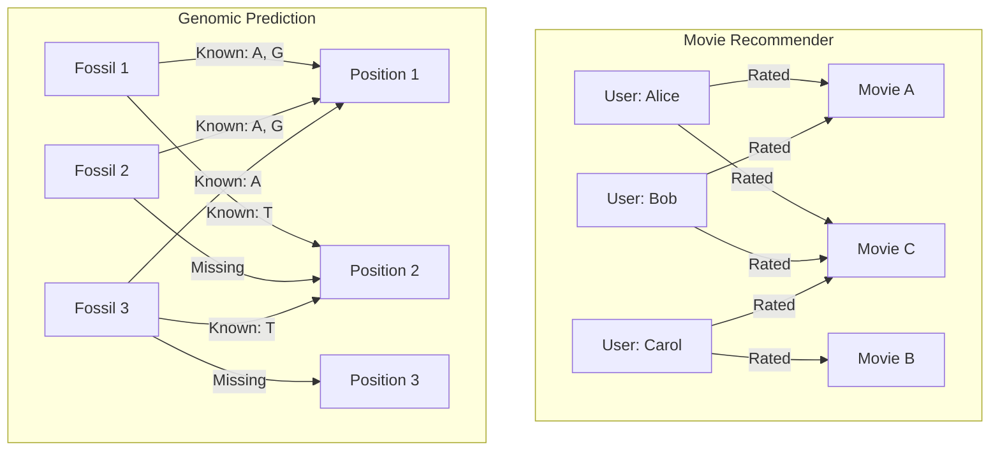

# 🎬 Understanding Collaborative Filtering: A Layman’s Guide

Have you ever wondered how Netflix or Spotify knows what you'll like next? 🤔  
That’s collaborative filtering in action — a smart way to **recommend** things based on **similar people's preferences**!

Let’s break it down step by step using a simple example.

---

## 🧩 Step 1: Our Starting Point – A Ratings Matrix

Imagine we have a small movie rating system with a few users and movies. Each user has rated some movies between 1 (👎) and 5 (👍), and left others unrated (blank).

|       | Movie A 🎥 | Movie B 🎬 | Movie C 📽️ | Movie D 📺 |
|-------|------------|------------|------------|------------|
| Alice | 5          |            | 3          |            |
| Bob   | 4          | 2          |            |            |
| Carol |            | 5          | 4          |            |
| Dave  |            | 4          |            | 2          |

*Can you spot the missing ratings? Our goal is to **predict them**!*

---

## 🔍 Step 2: What Is Collaborative Filtering?

**Collaborative filtering** is like asking your friends,  
_"Hey, you liked that movie — what else did you enjoy?"_

Instead of looking at the movies themselves (their genre, actors, etc.), we look at **user behavior** — who liked what.

There are two main flavors:
- **User-based filtering**: Find people similar to you and recommend what they liked.
- **Item-based filtering**: Find movies similar to the ones you liked, and recommend them.

We’ll focus on **user-based collaborative filtering** here.

---

## 🤝 Step 3: Find Similar Users

Let’s say Alice has rated Movie A (5) and Movie C (3).  
Bob has also rated Movie A (4) — maybe their tastes are similar?

To check this, we compare how their **ratings overlap** using similarity measures like:
- **Cosine similarity**
- **Pearson correlation**

This tells us how alike Alice and Bob are, based on their ratings.

---

## 📈 Step 4: Predict Missing Ratings

Suppose we want to predict **what rating Alice might give to Movie B**.

1. **Find users who have rated Movie B** (e.g., Bob, Carol, Dave).
2. **Check how similar they are to Alice.**
3. **Take a weighted average of their ratings**, giving more weight to similar users.

For example:
```
Predicted Rating (Alice → Movie B) ≈ (
    Similarity_Alice_Bob × Bob’s rating for B +
    Similarity_Alice_Carol × Carol’s rating for B +
    Similarity_Alice_Dave × Dave’s rating for B
)
/
(Sum of similarities)
```

Repeat this for all missing entries!

---

## 🧠 The Outcome: A Fully Filled Matrix!

After applying collaborative filtering, we can **predict missing ratings** and fill in the matrix:

|       | Movie A 🎥 | Movie B 🎬 | Movie C 📽️ | Movie D 📺 |
|-------|------------|------------|------------|------------|
| Alice | 5          | 4.2        | 3          | 3.5        |
| Bob   | 4          | 2          | 3.2        | 2.7        |
| Carol | 4.5        | 5          | 4          | 3.0        |
| Dave  | 3.8        | 4          | 3.5        | 2          |

Now we know what to recommend! 🥳  
- Alice might enjoy **Movie B** next.  
- Carol should check out **Movie A**.

---

## 💬 Summary

Collaborative filtering:
✅ Uses user behavior (ratings, preferences)  
✅ Finds similar users or items  
✅ Predicts missing values to make **personalized recommendations**

> It's like a group of friends whispering to each other:  
> "You liked that? Then you'll probably like this!" 😄

---

# 🧬 Cross-Application: Collaborative Filtering in Genomics

What if we took the same idea from movies and applied it to **dinosaurs**?  
Specifically, to **Stegosaurus DNA** from fossil records?

### 🦕 The Problem: Incomplete Genetic Sequences

Suppose we’ve unearthed **10 Stegosaurus fossils**, and scientists have **aligned** a specific gene across all 10.  
Due to fossil degradation, each specimen has **missing nucleotides** in different positions.

Here’s what the partial alignment might look like:

| Position | Specimen 1 | Specimen 2 | Specimen 3 | ... | Specimen 10 |
|----------|------------|------------|------------|-----|--------------|
| 1        | A          | A          | A          | ... | A            |
| 2        | G          | G          |            | ... | G            |
| 3        | T          |            | T          | ... | T            |
| 4        |            | C          | C          | ... |              |
| ...      | ...        | ...        | ...        | ... | ...          |

Each row is a **position in the gene**, and each column is a **fossil**.  
The goal: **fill in the missing nucleotides**.

---

### 🧠 The Insight: Use Collaborative Filtering!

Just like users rating movies, we treat:
- **Fossils as "users"**
- **Gene positions as "items"**
- **Nucleotide letters (A, C, G, T)** as "ratings"

Here's how **collaborative filtering** maps between a **movie recommender system** and **Stegosaurus gene reconstruction**:



In both domains:
- **Entities** (users/fossils) **interact** with **items** (movies/gene positions).
- We use **similarity** across known data to predict the unknown.

---

### 🔄 How It Works

1. **Identify Similar Specimens**  
   If two fossils have similar sequences in the known regions, we assume they likely share similar unknown regions too.

2. **Predict Missing Nucleotides**  
   For a missing value, look at what **similar fossils** have at that position.  
   Choose the **most likely nucleotide** (based on frequency, sequence similarity, and biological constraints).

3. **Apply Constraints from Biology**  
   DNA is structured:  
   - A pairs with T  
   - G pairs with C  
   
   This means **base pairing rules** can act like a filter to rule out biologically implausible predictions.

---

### 🧬 Why It Works

Fossil DNA might be **incomplete**, but by:
- Aligning all specimens
- Using pattern similarity
- Honoring biological rules

...we can reconstruct plausible genetic sequences — **just like filling in a movie rating matrix**!

---

## 🐍 Python Code for Genomic Collaborative Filtering

1. `dino_dna_fixer.py` is a very basic illustration using Hamming similarity to fill in missing DNA bases.
In real genomics, you'd use more sophisticated models and alignment-aware techniques.

2. After approximating all missing neucleotides with A, C, G, and T using `collaborative filtering`; you could further re-correct these approximations by using biology specific rules such as:
    - Base-pairing validation
    - Biological context (codons, conserved regions)
    - Multiple sequence alignment techniques

---

### 💡 Bonus: Use Cases in Modern Genomics

Collaborative filtering-style approaches are already used in:
- **Imputation of missing genotypes** in large-scale genomic studies
- **Reconstruction of ancient DNA** in paleogenomics
- **Error correction in next-gen sequencing**

---

