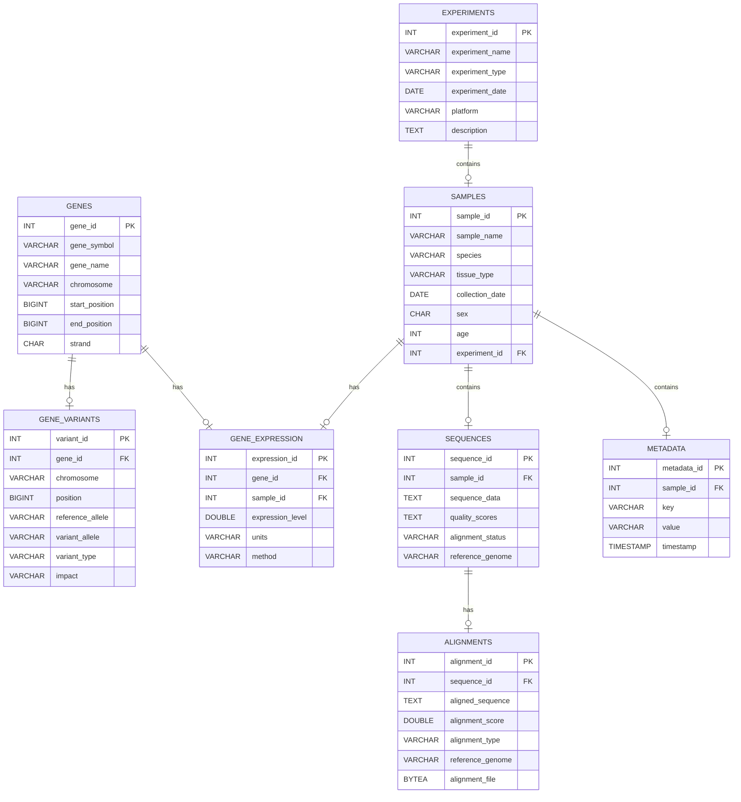

# Database Schema for Genomics

# Biological Experiment Tracking System - ERD with Examples

## EXPERIMENTS
Represents the details of an experiment.

| **Field**         | **Description**                                             | **Example**                                                   |
|-------------------|-------------------------------------------------------------|---------------------------------------------------------------|
| `experiment_id`   | Primary Key - Unique identifier for each experiment.        | `1`, `2`                                                      |
| `experiment_name` | Name of the experiment.                                     | `"Gene Expression Study"`, `"Cancer Mutations Study"`        |
| `experiment_type` | Type of the experiment (e.g., gene expression, sequencing). | `"Gene Expression"`, `"Genomic Sequencing"`                  |
| `experiment_date` | Date the experiment was conducted.                          | `"2023-05-10"`, `"2024-01-15"`                                |
| `platform`        | Platform used for the experiment (e.g., sequencing method). | `"Illumina"`, `"Nanopore"`                                   |
| `description`     | A description of the experiment.                            | `"Study of gene expression in cancer cells"`, `"Mapping mutations in humans"` |

**Example Data:**
| experiment_id | experiment_name          | experiment_type | experiment_date | platform | description                                   |
|---------------|--------------------------|-----------------|-----------------|----------|-----------------------------------------------|
| 1             | Gene Expression Study     | Gene Expression | 2023-05-10      | Illumina | Study of gene expression in cancer cells      |
| 2             | Cancer Mutations Study    | Genomic Sequencing | 2024-01-15   | Nanopore | Mapping mutations in humans                   |

---

## SAMPLES
Represents biological samples collected during an experiment.

| **Field**         | **Description**                                             | **Example**                                                   |
|-------------------|-------------------------------------------------------------|---------------------------------------------------------------|
| `sample_id`      | Primary Key - Unique identifier for each sample.           | `101`, `102`                                                  |
| `sample_name`    | Name or identifier of the sample.                          | `"Sample A"`, `"Sample B"`                                    |
| `species`        | Species from which the sample was collected.               | `"Homo sapiens"`, `"Mus musculus"`                            |
| `tissue_type`    | The type of tissue the sample was taken from.              | `"Lung"`, `"Liver"`                                           |
| `collection_date`| Date when the sample was collected.                        | `"2023-04-01"`, `"2023-05-15"`                                |
| `sex`            | Sex of the sample subject (e.g., Male, Female).            | `"M"`, `"F"`                                                  |
| `age`            | Age of the sample subject at collection time.              | `45`, `32`                                                    |
| `experiment_id`  | Foreign Key to EXPERIMENTS - The experiment this sample is part of. | `1`, `2`                                                     |

**Example Data:**
| sample_id | sample_name | species      | tissue_type | collection_date | sex | age | experiment_id |
|-----------|-------------|--------------|-------------|-----------------|-----|-----|---------------|
| 101       | Sample A    | Homo sapiens | Lung        | 2023-04-01      | M   | 45  | 1             |
| 102       | Sample B    | Mus musculus | Liver       | 2023-05-15      | F   | 32  | 2             |

---

## GENES
Contains information about genes under study.

| **Field**         | **Description**                                             | **Example**                                                   |
|-------------------|-------------------------------------------------------------|---------------------------------------------------------------|
| `gene_id`         | Primary Key - Unique identifier for each gene.             | `1`, `2`                                                      |
| `gene_symbol`     | Symbol representing the gene (e.g., "BRCA1").              | `"BRCA1"`, `"TP53"`                                           |
| `gene_name`       | Full name of the gene (e.g., "Breast Cancer 1").           | `"Breast Cancer 1"`, `"Tumor Protein p53"`                    |
| `chromosome`      | Chromosome where the gene is located.                      | `"17"`, `"17"`                                                |
| `start_position`  | Start position on the chromosome where the gene is located. | `43000000`, `75500000`                                        |
| `end_position`    | End position on the chromosome.                             | `45000000`, `75700000`                                        |
| `strand`          | DNA strand direction (e.g., "+" or "-").                    | `+`, `-`                                                      |

**Example Data:**
| gene_id | gene_symbol | gene_name          | chromosome | start_position | end_position | strand |
|---------|-------------|--------------------|------------|----------------|--------------|--------|
| 1       | BRCA1       | Breast Cancer 1    | 17         | 43000000       | 45000000     | +      |
| 2       | TP53        | Tumor Protein p53  | 17         | 75500000       | 75700000     | -      |

---

## GENE_VARIANTS
Describes variations within genes (e.g., mutations).

| **Field**         | **Description**                                             | **Example**                                                   |
|-------------------|-------------------------------------------------------------|---------------------------------------------------------------|
| `variant_id`      | Primary Key - Unique identifier for each gene variant.     | `1001`, `1002`                                                |
| `gene_id`         | Foreign Key to GENES - The gene this variant belongs to.   | `1`, `2`                                                      |
| `chromosome`      | Chromosome where the variant occurs.                        | `"17"`, `"17"`                                                |
| `position`        | Position of the variant on the chromosome.                  | `43100000`, `75550000`                                        |
| `reference_allele`| The reference allele (normal allele).                       | `"A"`, `"G"`                                                  |
| `variant_allele`  | The variant allele (mutated allele).                        | `"T"`, `"A"`                                                  |
| `variant_type`    | Type of variant (e.g., SNP, deletion).                     | `"SNP"`, `"Deletion"`                                         |
| `impact`          | The predicted impact of the variant (e.g., High, Medium).   | `"High"`, `"Low"`                                             |

**Example Data:**
| variant_id | gene_id | chromosome | position | reference_allele | variant_allele | variant_type | impact |
|------------|---------|------------|----------|------------------|----------------|--------------|--------|
| 1001       | 1       | 17         | 43100000 | A                | T              | SNP          | High   |
| 1002       | 2       | 17         | 75550000 | G                | A              | Deletion     | Low    |

---

## GENE_EXPRESSION
Stores the expression levels of genes in various samples.

| **Field**         | **Description**                                             | **Example**                                                   |
|-------------------|-------------------------------------------------------------|---------------------------------------------------------------|
| `expression_id`   | Primary Key - Unique identifier for each gene expression record. | `201`, `202`                                              |
| `gene_id`         | Foreign Key to GENES - The gene being expressed.            | `1`, `2`                                                      |
| `sample_id`       | Foreign Key to SAMPLES - The sample the expression comes from. | `101`, `102`                                                |
| `expression_level`| The level of expression (e.g., fold change).               | `5.2`, `0.8`                                                 |
| `units`           | Units used for measuring expression (e.g., RPKM).          | `"RPKM"`, `"FPKM"`                                            |
| `method`          | Method used for measuring expression (e.g., qPCR).         | `"qPCR"`, `"RNA-Seq"`                                         |

**Example Data:**
| expression_id | gene_id | sample_id | expression_level | units | method |
|---------------|---------|-----------|------------------|-------|--------|
| 201           | 1       | 101       | 5.2              | RPKM  | qPCR   |
| 202           | 2       | 102       | 0.8              | FPKM  | RNA-Seq|

---

## SEQUENCES
Represents the sequence data from samples.

| **Field**         | **Description**                                             | **Example**                                                   |
|-------------------|-------------------------------------------------------------|---------------------------------------------------------------|
| `sequence_id`     | Primary Key - Unique identifier for each sequence.         | `301`, `302`                                                  |
| `sample_id`       | Foreign Key to SAMPLES - The sample the sequence is from.   | `101`, `102`                                                  |
| `sequence_data`   | The actual sequence data.                                   | `"AGTCTGAC"`, `"GTCAGTCA"`                                    |
| `quality_scores`  | Quality scores for the sequence.                            | `"40 38 36"`, `"30 28 25"`                                    |
| `alignment_status`| Status of the sequence alignment (e.g., aligned, unaligned).| `"Aligned"`, `"Unaligned"`                                   |
| `reference_genome`| The reference genome used for alignment.                    | `"hg38"`, `"mm10"`                                            |

**Example Data:**
| sequence_id | sample_id | sequence_data | quality_scores | alignment_status | reference_genome |
|-------------|-----------|---------------|----------------|------------------|------------------|
| 301         | 101       | AGTCTGAC      | 40 38 36       | Aligned          | hg38             |
| 302         | 102       | GTCAGTCA      | 30 28 25       | Unaligned        | mm10             |

---

## ALIGNMENTS
Represents alignment data for sequence comparisons.

| **Field**         | **Description**                                             | **Example**                                                   |
|-------------------|-------------------------------------------------------------|---------------------------------------------------------------|
| `alignment_id`    | Primary Key - Unique identifier for each alignment.        | `401`, `402`                                                  |
| `sequence_id`     | Foreign Key to SEQUENCES - The sequence being aligned.     | `301`, `302`                                                  |
| `aligned_sequence`| The aligned sequence.                                      | `"AGTCTGAC"`, `"GTCAGTCA"`                                    |
| `alignment_score` | The score of the alignment (e.g., percentage of identity). | `95.6`, `89.2`                                                |
| `alignment_type`  | Type of alignment (e.g., pairwise, multiple).              | `"Pairwise"`, `"Multiple"`                                    |
| `reference_genome`| The reference genome used in the alignment.                 | `"hg38"`, `"mm10"`                                            |
| `alignment_file`  | A file containing the alignment data (binary format).      | `alignment1.bam`, `alignment2.bam`                            |

**Example Data:**
| alignment_id | sequence_id | aligned_sequence | alignment_score | alignment_type | reference_genome | alignment_file |
|--------------|-------------|------------------|-----------------|-----------------|------------------|----------------|
| 401          | 301         | AGTCTGAC         | 95.6            | Pairwise        | hg38             | alignment1.bam |
| 402          | 302         | GTCAGTCA         | 89.2            | Multiple        | mm10             | alignment2.bam |

---

## METADATA
Contains additional metadata associated with samples.

| **Field**         | **Description**                                             | **Example**                                                   |
|-------------------|-------------------------------------------------------------|---------------------------------------------------------------|
| `metadata_id`     | Primary Key - Unique identifier for each metadata record.   | `501`, `502`                                                  |
| `sample_id`       | Foreign Key to SAMPLES - The sample this metadata is associated with. | `101`, `102`                                               |
| `key`             | The metadata key (e.g., "patient_id", "age").                | `"patient_id"`, `"treatment_date"`                            |
| `value`           | The value for the metadata key.                             | `"12345"`, `"2023-04-01"`                                    |
| `timestamp`       | Timestamp of when the metadata was recorded.                | `"2023-04-01 10:00"`, `"2023-05-15 14:30"`                   |

**Example Data:**
| metadata_id | sample_id | key            | value     | timestamp            |
|-------------|-----------|----------------|-----------|----------------------|
| 501         | 101       | patient_id     | 12345     | 2023-04-01 10:00     |
| 502         | 102       | treatment_date | 2023-04-01| 2023-05-15 14:30     |
