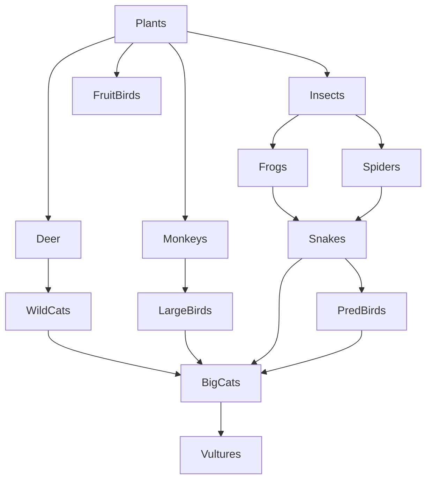

# Modelling a Food Web in a Forest

This Python project simulates the dynamics of a **forest food web** using an **ODE-based ecosystem model**. It incorporates various species interactions (e.g., predator-prey), seasonal sunlight-driven plant growth, decomposer nutrient recycling, and external ecological shocks like **droughts** and **hunting**.

## 🌳 Features

- **14 species** modeled, including plants, insects, herbivores, carnivores, birds, and decomposers.
- **Predator-prey relationships** modeled using a predation matrix.
- **Seasonal sunlight** affecting plant growth through a sinusoidal function.
- **Ecological shocks** like droughts and hunting events that periodically impact the ecosystem.
- **Decomposers** recycle nutrients from dead organisms to boost plant growth.
- **ODE system** solved using `scipy.integrate.odeint`.
- **Visualization** of species population dynamics over time.

## 🌿🦗🦎🦅 Food Web



## 🧬 Modeled Species

- **Producers**: Plants  
- **Primary Consumers**: Insects, FruitBirds, Deer, Monkeys  
- **Secondary Consumers**: Frogs, Spiders  
- **Tertiary Consumers**: WildCats, LargeBirds, Snakes  
- **Top Predators**: BigCats, PredBirds  
- **Scavengers/Decomposers**: Vultures, Decomposers

## 📊 Model Highlights

- **Plant Growth**:
  - Modeled with logistic growth.
  - Carrying capacity varies with seasonal sunlight using:  
\[
R(t) = 100 + 50 \cdot \sin\left(\frac{2\pi t}{50}\right)
\]
\[
K_{\text{plants}}(t) = K_{\text{max}} \cdot \left(1 - e^{-\beta R(t)}\right)
\]

- **Decomposers**:
  - Increase by feeding on natural deaths of all other species.
  - Provide nutrient recycling feedback to boost plant growth.

- **Ecological Shocks**:
  - **Droughts** reduce plant growth every 70–80 time units.
  - **Hunting** reduces predator populations every 150–160 time units.

## 🚀 Running the Simulation

#### 🧪 Requirements

- Python 3.x
- `numpy`
- `scipy`
- `matplotlib`

You can install dependencies in a virtual environment:

```bash
python3 -m venv forest-venv
source forest-venv/bin/activate  # or forest-venv\Scripts\activate on Windows
pip3 install numpy scipy matplotlib
```

Simply run the script:

```bash
python3 forest_food_web.py
```

This will generate a plot showing population dynamics for all species over a 200-time-unit simulation window.

## 📈 Output

- A **line chart** showing how each species' population evolves over time.
- Legend distinguishes each species with different line colors.

## 🧠 Future Improvements

- Include species-specific parameters (e.g. varying death/growth rates).
- Add user interactivity or sliders for shock timing and intensity.
- Incorporate spatial models or stochasticity.

---

Developed for ecological modeling and educational purposes 🌿
