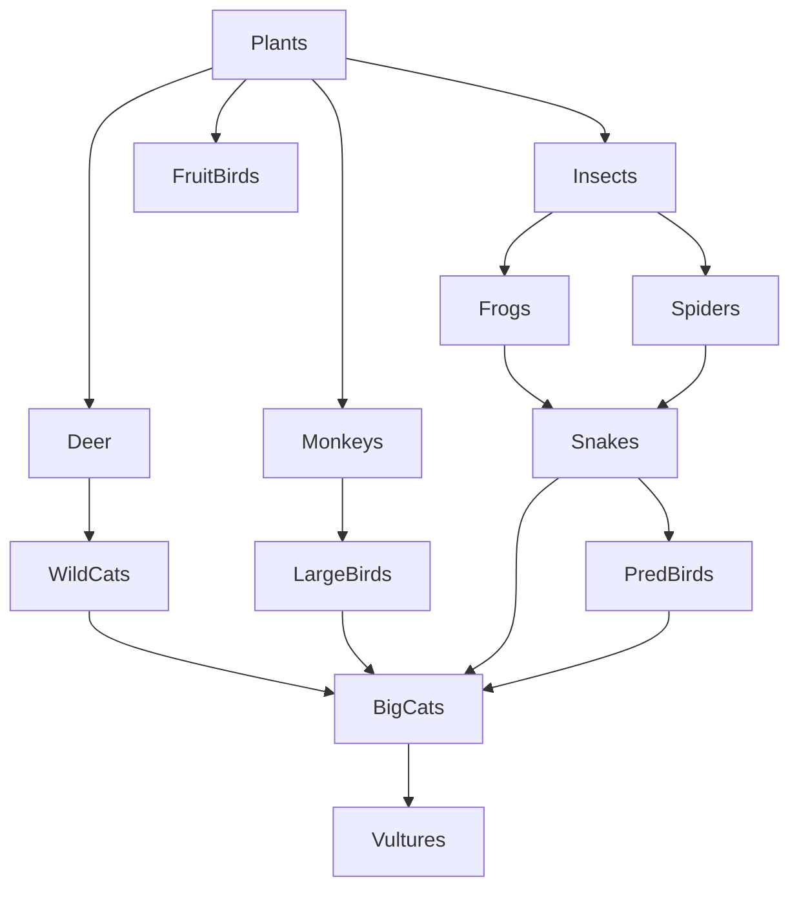

# Modelling a Food Web in a Forest

This Python project simulates the dynamics of a **forest food web** using an **ODE-based ecosystem model**. It incorporates various species interactions (e.g., predator-prey), seasonal sunlight-driven plant growth, decomposer nutrient recycling, and external ecological shocks like **droughts** and **hunting**.

## 🌳 Features

- **14 species** modeled, including plants, insects, herbivores, carnivores, birds, and decomposers.
- **Predator-prey relationships** modeled using a predation matrix.
- **Seasonal sunlight** affecting plant growth through a sinusoidal function.
- **Ecological shocks** like droughts and hunting events that periodically impact the ecosystem.
- **Decomposers** recycle nutrients from dead organisms to boost plant growth.
- **ODE system** solved using `scipy.integrate.odeint`.
- **Visualization** of species population dynamics over time.

## 🌿🦗🦎🦅 Food Web



## 🧬 Modeled Species

- **Producers**: Plants  
- **Primary Consumers**: Insects, FruitBirds, Deer, Monkeys  
- **Secondary Consumers**: Frogs, Spiders  
- **Tertiary Consumers**: WildCats, LargeBirds, Snakes  
- **Top Predators**: BigCats, PredBirds  
- **Scavengers/Decomposers**: Vultures, Decomposers

## 📖 Essential Definitions

**🌿🐾🍄 Species**
```
species = [
    "🌿 Plants",
    "🐞 Insects",
    "🕊️ FruitBirds",
    "🦌 Deer",
    "🐒 Monkeys",
    "🐸 Frogs",
    "🕷️ Spiders",
    "🐆 WildCats",
    "🦃 LargeBirds",
    "🐍 Snakes",
    "🦁 BigCats",
    "🦅 PredBirds",
    "🦤 Vultures",
    "🍄 Decomposers"
]
```

**🌿🐾🍄 Species Index** (i)

| Index (i) | Species               |
|-------|------------------------|
| 0     | 🌿 Plants              |
| 1     | 🐞 Insects             |
| 2     | 🕊️ FruitBirds         |
| 3     | 🦌 Deer                |
| 4     | 🐒 Monkeys             |
| 5     | 🐸 Frogs               |
| 6     | 🕷️ Spiders            |
| 7     | 🐆 WildCats            |
| 8     | 🦃 LargeBirds          |
| 9     | 🐍 Snakes              |
| 10    | 🦁 BigCats             |
| 11    | 🦅 PredBirds           |
| 12    | 🦤 Vultures            |
| 13    | 🍄 Decomposers         |

**🦁➡️🦌 {Predator -> Prey} Edges (extracted from the Food Web)**

| Predator         |   ➡️   | Prey           |
|------------------|:-----:|----------------|
| 🐞 Insects        |  ➡️   | 🌿 Plants       |
| 🕊️ FruitBirds     |  ➡️   | 🌿 Plants       |
| 🦌 Deer           |  ➡️   | 🌿 Plants       |
| 🐒 Monkeys        |  ➡️   | 🌿 Plants       |
| 🐸 Frogs          |  ➡️   | 🐞 Insects      |
| 🕷️ Spiders        |  ➡️   | 🐞 Insects      |
| 🐆 WildCats       |  ➡️   | 🦌 Deer         |
| 🦃 LargeBirds     |  ➡️   | 🐒 Monkeys      |
| 🐍 Snakes         |  ➡️   | 🐸 Frogs        |
| 🐍 Snakes         |  ➡️   | 🕷️ Spiders      |
| 🦅 PredBirds      |  ➡️   | 🐍 Snakes       |
| 🦁 BigCats        |  ➡️   | 🐆 WildCats     |
| 🦁 BigCats        |  ➡️   | 🦃 LargeBirds   |
| 🦁 BigCats        |  ➡️   | 🐍 Snakes       |
| 🦁 BigCats        |  ➡️   | 🦅 PredBirds    |
| 🦤 Vultures       |  ➡️   | 🦁 BigCats      |

**🦁🔢🦌 Predation Matrix (A)**

- The <i>Predation Matrix</i> **A** is derived from the collection of **{Predator -> Prey} Edges**  
- **Each row** in the <i>Predation Matrix</i> **A** represents a **🦁Predator**.
- <i>Row index</i> is denoted by **x**; where **x** ∈ **i**.
- **Each column** in the <i>Predation Matrix</i> **A** represents a **🦌Prey**.
- <i>Column index</i> is denoted by **y**; where **y** ∈ **i**.
- Recall that **i** is the **Species Index** with integer values **from 0 to 13**.

| #  | Species             | 0 🌿 Plants | 1 🐞 Insects | 2 🕊️ FruitBirds | 3 🦌 Deer | 4 🐒 Monkeys | 5 🐸 Frogs | 6 🕷️ Spiders | 7 🐆 WildCats | 8 🦃 LargeBirds | 9 🐍 Snakes | 10 🦁 BigCats | 11 🦅 PredBirds | 12 🦤 Vultures | 13 🍄 Decomposers |
|----|---------------------|-------------|--------------|------------------|-----------|--------------|------------|---------------|----------------|----------------|--------------|----------------|----------------|----------------|--------------------|
| 0  | 🌿 Plants           | ⬜ 0        | ⬜ 0         | ⬜ 0             | ⬜ 0      | ⬜ 0         | ⬜ 0       | ⬜ 0          | ⬜ 0           | ⬜ 0           | ⬜ 0         | ⬜ 0           | ⬜ 0           | ⬜ 0           | ⬜ 0                 |
| 1  | 🐞 Insects          | ✅ 1        | ⬜ 0         | ⬜ 0             | ⬜ 0      | ⬜ 0         | ⬜ 0       | ⬜ 0          | ⬜ 0           | ⬜ 0           | ⬜ 0         | ⬜ 0           | ⬜ 0           | ⬜ 0           | ⬜ 0                 |
| 2  | 🕊️ FruitBirds       | ✅ 1        | ⬜ 0         | ⬜ 0             | ⬜ 0      | ⬜ 0         | ⬜ 0       | ⬜ 0          | ⬜ 0           | ⬜ 0           | ⬜ 0         | ⬜ 0           | ⬜ 0           | ⬜ 0           | ⬜ 0                 |
| 3  | 🦌 Deer             | ✅ 1        | ⬜ 0         | ⬜ 0             | ⬜ 0      | ⬜ 0         | ⬜ 0       | ⬜ 0          | ⬜ 0           | ⬜ 0           | ⬜ 0         | ⬜ 0           | ⬜ 0           | ⬜ 0           | ⬜ 0                 |
| 4  | 🐒 Monkeys          | ✅ 1        | ⬜ 0         | ⬜ 0             | ⬜ 0      | ⬜ 0         | ⬜ 0       | ⬜ 0          | ⬜ 0           | ⬜ 0           | ⬜ 0         | ⬜ 0           | ⬜ 0           | ⬜ 0           | ⬜ 0                 |
| 5  | 🐸 Frogs            | ⬜ 0        | ✅ 1         | ⬜ 0             | ⬜ 0      | ⬜ 0         | ⬜ 0       | ⬜ 0          | ⬜ 0           | ⬜ 0           | ⬜ 0         | ⬜ 0           | ⬜ 0           | ⬜ 0           | ⬜ 0                 |
| 6  | 🕷️ Spiders          | ⬜ 0        | ✅ 1         | ⬜ 0             | ⬜ 0      | ⬜ 0         | ⬜ 0       | ⬜ 0          | ⬜ 0           | ⬜ 0           | ⬜ 0         | ⬜ 0           | ⬜ 0           | ⬜ 0           | ⬜ 0                 |
| 7  | 🐆 WildCats         | ⬜ 0        | ⬜ 0         | ⬜ 0             | ✅ 1      | ⬜ 0         | ⬜ 0       | ⬜ 0          | ⬜ 0           | ⬜ 0           | ⬜ 0         | ⬜ 0           | ⬜ 0           | ⬜ 0           | ⬜ 0                 |
| 8  | 🦃 LargeBirds       | ⬜ 0        | ⬜ 0         | ⬜ 0             | ⬜ 0      | ✅ 1         | ⬜ 0       | ⬜ 0          | ⬜ 0           | ⬜ 0           | ⬜ 0         | ⬜ 0           | ⬜ 0           | ⬜ 0           | ⬜ 0                 |
| 9  | 🐍 Snakes           | ⬜ 0        | ⬜ 0         | ⬜ 0             | ⬜ 0      | ⬜ 0         | ✅ 1       | ✅ 1          | ⬜ 0           | ⬜ 0           | ⬜ 0         | ⬜ 0           | ⬜ 0           | ⬜ 0           | ⬜ 0                 |
| 10 | 🦁 BigCats          | ⬜ 0        | ⬜ 0         | ⬜ 0             | ⬜ 0      | ⬜ 0         | ⬜ 0       | ⬜ 0          | ✅ 1           | ✅ 1           | ✅ 1         | ⬜ 0           | ✅ 1           | ⬜ 0           | ⬜ 0                 |
| 11 | 🦅 PredBirds        | ⬜ 0        | ⬜ 0         | ⬜ 0             | ⬜ 0      | ⬜ 0         | ⬜ 0       | ⬜ 0          | ⬜ 0           | ⬜ 0           | ✅ 1         | ⬜ 0           | ⬜ 0           | ⬜ 0           | ⬜ 0                 |
| 12 | 🦤 Vultures         | ⬜ 0        | ⬜ 0         | ⬜ 0             | ⬜ 0      | ⬜ 0         | ⬜ 0       | ⬜ 0          | ⬜ 0           | ⬜ 0           | ⬜ 0         | ✅ 1           | ⬜ 0           | ⬜ 0           | ⬜ 0                 |
| 13 | 🍄 Decomposers      | ⬜ 0        | ⬜ 0         | ⬜ 0             | ⬜ 0      | ⬜ 0         | ⬜ 0       | ⬜ 0          | ⬜ 0           | ⬜ 0           | ⬜ 0         | ⬜ 0           | ⬜ 0           | ⬜ 0           | ⬜ 0                 |

**🧩🐍🛠️ Putting it Altogether in Python**
```python
import numpy as np

# Species and their indices
species = [
    "Plants", "Insects", "FruitBirds", "Deer", "Monkeys",
    "Frogs", "Spiders", "WildCats", "LargeBirds", "Snakes",
    "BigCats", "PredBirds", "Vultures", "Decomposers"
]
species_index = {name: i for i, name in enumerate(species)}

# We have a total of 14 different species
n = len(species)

# Predator-prey edges
edges = [
    ("Insects", "Plants"),
    ("FruitBirds", "Plants"),
    ("Deer", "Plants"),
    ("Monkeys", "Plants"),
    ("Frogs", "Insects"),
    ("Spiders", "Insects"),
    ("WildCats", "Deer"),
    ("LargeBirds", "Monkeys"),
    ("Snakes", "Frogs"),
    ("Snakes", "Spiders"),
    ("PredBirds", "Snakes"),
    ("BigCats", "WildCats"),
    ("BigCats", "LargeBirds"),
    ("BigCats", "Snakes"),
    ("BigCats", "PredBirds"),
    ("Vultures", "BigCats")
]

# Predation matrix
predation_matrix = np.zeros((n, n))  # [predator][prey]
for predator, prey in edges:
    x, y = species_index[predator], species_index[prey]
    predation_matrix[x, y] = 1
```


## 📊 Model Highlights

- **Plant Growth**:
  - Modeled with logistic growth.
  - Carrying capacity varies with seasonal sunlight.

- **Decomposers**:
  - Increase by feeding on natural deaths of all other species.
  - Provide nutrient recycling feedback to boost plant growth.

- **Ecological Shocks**:
  - **Droughts** reduce plant growth every 70–80 time units.
  - **Hunting** reduces predator populations every 150–160 time units.

## 🧮 Math Equations

✍️ Let:
- Y<sub>i</sub>(t): Population of species *i* at time *t*  
- r<sub>plants</sub>: Intrinsic growth rate of *plants*
- κ<sub>max</sub>: Maximum Carrying capacity of *plants*
- κ<sub>d</sub>: Decomposition rate by *decomposers*
- κ<sub>p</sub>: Nutrient uptake rate by *plants*
- d<sub>i</sub>: Natural death rate of species *i*
- A<sub>xy</sub> ∈ {0, 1}: Predation matrix; 1 if *x* preys on *y*
  - *x* is the predator
  - *y* is the prey
- α<sub>xy</sub>: Attack rate of predator *x* on prey *y*  
- ε<sub>xy</sub>: Efficiency of converting consumed prey *y* to biomass for predator *x*

### ☀️🌦️🍂 R(t): Seasonal Sunlight

$$
R(t) = 100 + 50 * \sin\left(\frac{2 * \pi * t}{50}\right)
$$

- Simulates seasonal variation in sunlight.
- Models sunlight intensity R(t) as a sinusoidal function (periodic with time t).
- It cycles every 50 time units (e.g., days, weeks).
- Sunlight ranges between 50 and 150:
  - min: 100 − 50 = 50
  - max: 100 + 50 = 150

### 🌱📈🌿 κ<sub>plants</sub>(t): Plant Carrying Capacity

$$
κ_\text{plants}(t) = κ_{\text{max}} * \left(1 - e^{-\beta * R(t)}\right)
$$

- Plants can grow more when there's more sunlight, but only up to a limit.
- Models dynamic carrying capacity based on current sunlight R.
- Follows a saturating exponential curve:
  - When R is small: K<sub>plants</sub> is small.
  - As R increases, 𝐾<sub>plants</sub> → 𝐾<sub>max</sub>
- β is a smoothing factor for simulating a continuous transition during plant growth or decline (0 < β < 1)

### 🌵☀️💧🚫 δ(t): Drought Factor

This factor simulates periods of drought and affects plant growth.

##### Definition:
- δ(t) = 0.3 if 70 ≤ (t mod 100) ≤ 80,
- δ(t) = 1.0 otherwise

##### Explanation:
- Every **100 time steps**, there is a **10-step drought window** from step 70 to 80.
- During this window, δ(t) = **0.3**, representing **scarce resources or harsh conditions**.
- Outside this window, δ(t) = **1.0**, indicating **normal environmental conditions**.

### 🏹🐺📉 η(t): Hunting Factor

This factor simulates external (e.g. human) hunting pressure, but **only** on top predators.

##### Definition:
- η(t) = 0.5 if 150 ≤ (t mod 200) ≤ 160 and i ∈ {BigCats, PredBirds},
- η(t) = 1.0 otherwise

##### Explanation:
- Every **200 time steps**, there is a **10-step hunting season** from step 150 to 160.
- During this window, **BigCats** and **PredBirds** experience increased suppression (modeled as η(t) = **0.5**).
- All other species are unaffected.
- Outside the hunting season, η(t) = **1.0** for all species.

### 🌾🔄🌱 [ dY<sub>0</sub>(t) / dt ]: Plant Dynamics (when $i = 0$):

$$
\frac{dY_0(t)}{dt} = r_\text{plants} * Y_0(t) * \left(1 - \frac{Y_0(t)}{κ_\text{plants}(t)}\right) * \delta(t) + \left(κ_p * Y_{13}(t)\right) - \left(\sum_{x=1}^{n-1} A_{x0} * \alpha_{x0} * Y_x(t)\right) * Y_0(t) - \left(d_0 * Y_0(t)\right)
$$

### 🐾🦌🦊 [ dY<sub>i</sub>(t) / dt ]: Other species (when $i \ne 0, 13$):

$$
\frac{dY_i(t)}{dt} = \left(\sum_{y=0}^{n-1} A_{iy} * \alpha_{iy} * \epsilon_{iy} * Y_y(t)\right) * Y_i(t) - \left(\sum_{x=0}^{n-1} * A_{xi} * \alpha_{xi} * Y_x(t)\right) * Y_i(t) - \left(d_i * Y_i(t)\right)
$$

- 🏹🐺 <i>hunting adjustment</i>

$$
\text{when } \left( i \in \text{BigCats} \right) OR \left( i \in \text{PredBirds} \right)
$$

$$
\hspace{3cm} \text{apply hunting factor } \rightarrow \text{ } \frac{dY_i(t)}{dt} = \frac{dY_i(t)}{dt} * \eta(t)
$$

### 🍄🪱🧫 [ dY<sub>13</sub>(t) / dt ]: Decomposers (when $i = 13$):

$$
\frac{dY_{13}(t)}{dt} = κ_d * \left(\sum_{\substack{j=0 \\ j \ne 13}}^{n-1} d_j * Y_j(t)\right) - \left(d_{13} * Y_{13}(t)\right)
$$


## 🚀 Running the Simulation

#### 🧪 Requirements

- Python 3.x
- `numpy`
- `scipy`
- `matplotlib`

You can install dependencies in a virtual environment:

```bash
python3 -m venv forest-venv
source forest-venv/bin/activate  # or forest-venv\Scripts\activate on Windows
pip3 install numpy scipy matplotlib
```

Simply run the script:

```bash
python3 forest_food_web.py
```

This will generate a plot showing population dynamics for all species over a 200-time-unit simulation window.

## 📈 Output

- A **line chart** showing how each species' population evolves over time.
- Legend distinguishes each species with different line colors.

## 🧠 Future Improvements

- Include species-specific parameters (e.g. varying death/growth rates).
- Add user interactivity or sliders for shock timing and intensity.
- Incorporate spatial models or stochasticity.

---

Developed for ecological modeling and educational purposes 🌿
