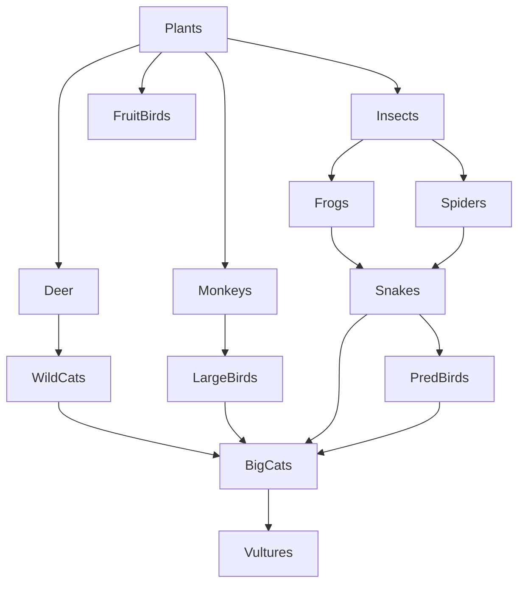

# Modelling a Food Web in a Forest

This Python project simulates the dynamics of a **forest food web** using an **ODE-based ecosystem model**. It incorporates various species interactions (e.g., predator-prey), seasonal sunlight-driven plant growth, decomposer nutrient recycling, and external ecological shocks like **droughts** and **hunting**.

## 🌳 Features

- **14 species** modeled, including plants, insects, herbivores, carnivores, birds, and decomposers.
- **Predator-prey relationships** modeled using a predation matrix.
- **Seasonal sunlight** affecting plant growth through a sinusoidal function.
- **Ecological shocks** like droughts and hunting events that periodically impact the ecosystem.
- **Decomposers** recycle nutrients from dead organisms to boost plant growth.
- **ODE system** solved using `scipy.integrate.odeint`.
- **Visualization** of species population dynamics over time.

## 🌿🦗🦎🦅 Food Web



## 🧬 Modeled Species

- **Producers**: Plants  
- **Primary Consumers**: Insects, FruitBirds, Deer, Monkeys  
- **Secondary Consumers**: Frogs, Spiders  
- **Tertiary Consumers**: WildCats, LargeBirds, Snakes  
- **Top Predators**: BigCats, PredBirds  
- **Scavengers/Decomposers**: Vultures, Decomposers

## 📊 Model Highlights

- **Plant Growth**:
  - Modeled with logistic growth.
  - Carrying capacity varies with seasonal sunlight.

- **Decomposers**:
  - Increase by feeding on natural deaths of all other species.
  - Provide nutrient recycling feedback to boost plant growth.

- **Ecological Shocks**:
  - **Droughts** reduce plant growth every 70–80 time units.
  - **Hunting** reduces predator populations every 150–160 time units.

## 🧮 Math Equations

Let:
- Y<sub>i</sub>(t): Population of species *i* at time *t*  
- r<sub>plants</sub>: Intrinsic growth rate of *plants*  
- K<sub>plants</sub>(t): Carrying capacity of *plants* (time-dependent)
- K<sub>max</sub>: Maximum Carrying capacity of *plants*   
- d<sub>i</sub>: Natural death rate of species *i*  
- α<sub>ij</sub>: Attack rate of predator *i* on prey *j*  
- ε<sub>ij</sub>: Efficiency of converting consumed prey *j* to biomass for predator *i*  
- A<sub>ij</sub> ∈ {0, 1}: Predation matrix; 1 if *i* preys on *j*
  - *i* is the predator
  - *j* is the prey 
- R(t): Sunlight availability at time *t*  
- δ(t): Drought factor  
  - δ(t) = 0.3 if 70 ≤ (t mod 100) ≤ 80,  
  - else δ(t) = 1.0  
- η(t): Hunting factor  
  - η(t) = 0.5 if 150 ≤ (t mod 200) ≤ 160 and *i* ∈ {BigCats, PredBirds},  
  - else η(t) = 1.0

**🦁➡️🦌 Predation Matrix (A)**
```python
import numpy as np

# Species and their indices
species = [
    "Plants", "Insects", "FruitBirds", "Deer", "Monkeys",
    "Frogs", "Spiders", "WildCats", "LargeBirds", "Snakes",
    "BigCats", "PredBirds", "Vultures", "Decomposers"
]
species_index = {name: i for i, name in enumerate(species)}

# We have a total of 14 different species
n = len(species)

# Predator-prey edges
edges = [
    ("Insects", "Plants"),
    ("FruitBirds", "Plants"),
    ("Deer", "Plants"),
    ("Monkeys", "Plants"),
    ("Frogs", "Insects"),
    ("Spiders", "Insects"),
    ("WildCats", "Deer"),
    ("LargeBirds", "Monkeys"),
    ("Snakes", "Frogs"),
    ("Snakes", "Spiders"),
    ("PredBirds", "Snakes"),
    ("BigCats", "WildCats"),
    ("BigCats", "LargeBirds"),
    ("BigCats", "Snakes"),
    ("BigCats", "PredBirds"),
    ("Vultures", "BigCats")
]

# Predation matrix
predation_matrix = np.zeros((n, n))  # [predator][prey]
for predator, prey in edges:
    i, j = species_index[predator], species_index[prey]
    predation_matrix[i, j] = 1
```

**☀️🌦️🍂 Seasonal Sunlight**

$$
R(t) = 100 + 50 * \sin\left(\frac{2 * \pi * t}{50}\right)
$$

- Simulates seasonal variation in sunlight.
- Models sunlight intensity R(t) as a sinusoidal function (periodic with time t).
- It cycles every 50 time units (e.g., days, weeks).
- Sunlight ranges between 50 and 150:
  - min: 100 − 50 = 50
  - max: 100 + 50 = 150

**🌱📈🌿 Plant Carrying Capacity**

$$
K_\text{plants}(t) = K_{\text{max}} * \left(1 - e^{-\beta * R(t)}\right)
$$

- Plants can grow more when there's more sunlight, but only up to a limit.
- Models dynamic carrying capacity based on current sunlight R.
- Follows a saturating exponential curve:
  - When R is small: K<sub>plants</sub> is small.
  - As R increases, 𝐾<sub>plants</sub> → 𝐾<sub>max</sub>

**🌾🔄🌱 Plant Dynamics** (when $i = 0$):

$$
\frac{dY_0}{dt} = r_\text{plants} * Y_0 * \left(1 - \frac{Y_0}{K_\text{plants}(t)}\right) * \delta(t) + \left(0.02 * Y_{13}\right) - \left(\sum_{j=1}^{n-1} A_{j0} * \alpha_{j0} * Y_j\right) * Y_0 - \left(d_0 * Y_0\right)
$$

**🐾🦌🦊 Other species** (when $i \ne 0, 13$):

$$
\frac{dY_i}{dt} = \left(\sum_{j=0}^{n-1} A_{ij} * \alpha_{ij} * Y_j * \epsilon_{ij}\right) * Y_i - \left(\sum_{j=0}^{n-1} * A_{ji} * \alpha_{ji} * Y_j\right) * Y_i - \left(d_i * Y_i\right)
$$

**🍄🪱🧫 Decomposers** (when $i = 13$):

$$
\frac{dY_{13}}{dt} = 0.05 * \left(\sum_{\substack{j=0 \\ j \ne 13}}^{n-1} d_j * Y_j\right) - \left(d_{13} * Y_{13}\right)
$$

**🏹🐺📉 Hunting Adjustment**

$$
\text{when } \left( i \in \text{BigCats} \right) OR \left( i \in \text{PredBirds} \right)
$$

$$
\hspace{3cm} \text{apply hunting factor } \rightarrow \text{ } \frac{dY_i}{dt} = \frac{dY_i}{dt} * \eta(t)
$$


## 🚀 Running the Simulation

#### 🧪 Requirements

- Python 3.x
- `numpy`
- `scipy`
- `matplotlib`

You can install dependencies in a virtual environment:

```bash
python3 -m venv forest-venv
source forest-venv/bin/activate  # or forest-venv\Scripts\activate on Windows
pip3 install numpy scipy matplotlib
```

Simply run the script:

```bash
python3 forest_food_web.py
```

This will generate a plot showing population dynamics for all species over a 200-time-unit simulation window.

## 📈 Output

- A **line chart** showing how each species' population evolves over time.
- Legend distinguishes each species with different line colors.

## 🧠 Future Improvements

- Include species-specific parameters (e.g. varying death/growth rates).
- Add user interactivity or sliders for shock timing and intensity.
- Incorporate spatial models or stochasticity.

---

Developed for ecological modeling and educational purposes 🌿
