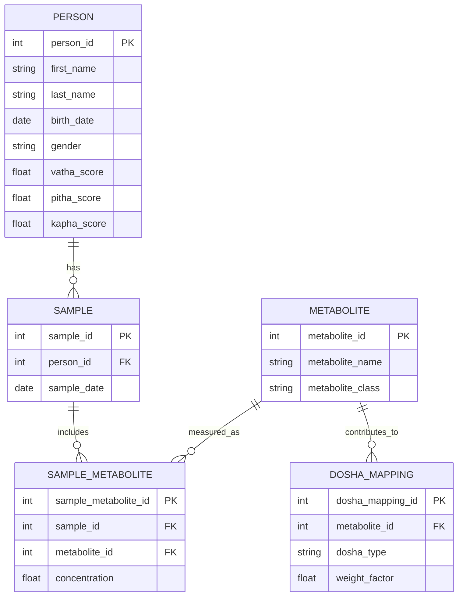

# Metabolomics Database Schema, Dosha Calculation, and Prakriti Evaluation

---

## 1. Metabolomics Database Schema (Mermaid.js ER Diagram)



## 2. Field Descriptions and Example Data

### PERSON Table
The `PERSON` table stores information about individuals in the study. The table includes dosha scores to track the Ayurvedic constitution of the person.

Example Data:

| person_id | first_name | last_name | birth_date | gender | vatha_score | pitha_score | kapha_score |
|-----------|------------|-----------|------------|--------|-------------|-------------|-------------|
| 1         | John       | Doe       | 1990-01-01 | Male   | 45.5        | 38.7        | 30.2        |
| 2         | Jane       | Smith     | 1985-02-10 | Female | 35.0        | 40.2        | 27.5        |
| 3         | Michael    | Brown     | 1992-07-22 | Male   | 50.1        | 30.0        | 29.3        |

### SAMPLE Table
The `SAMPLE` table stores sample information, including the person associated with the sample and the collection date.

Example Data:

| sample_id | person_id | sample_date |
|-----------|-----------|-------------|
| 1001      | 1         | 2024-04-01  |
| 1002      | 2         | 2024-04-05  |
| 1003      | 3         | 2024-04-10  |

### METABOLITE Table
The `METABOLITE` table stores information about metabolites, including their names and classifications.

Example Data:

| metabolite_id | metabolite_name | metabolite_class |
|---------------|-----------------|------------------|
| 501           | Glucose         | Sugar            |
| 502           | Cholesterol     | Lipid            |
| 503           | Creatinine      | Protein          |

### SAMPLE_METABOLITE Table
The `SAMPLE_METABOLITE` table links samples to metabolites, capturing the concentration of metabolites measured in each sample.

Example Data:

| sample_metabolite_id | sample_id | metabolite_id | concentration |
|----------------------|-----------|---------------|---------------|
| 10001                | 1001      | 501           | 5.6           |
| 10002                | 1002      | 502           | 4.2           |
| 10003                | 1003      | 503           | 3.1           |

### DOSHA_MAPPING Table
The `DOSHA_MAPPING` table maps metabolites to doshas, with a weight factor indicating how strongly each metabolite contributes to a particular dosha.

Example Data:

| dosha_mapping_id | metabolite_id | dosha_type | weight_factor |
|------------------|---------------|------------|---------------|
| 2001             | 501           | Vatha      | 0.8           |
| 2002             | 502           | Pitha      | 1.2           |
| 2003             | 503           | Kapha      | 0.5           |

## 3. Python Code to Update Dosha Values Over Time

```python
import sqlite3

def update_dosha_scores(sample_id, db_path="metabolomics.db"):
    conn = sqlite3.connect(db_path)
    cursor = conn.cursor()

    query = """
        SELECT
            s.person_id,
            sm.concentration,
            dm.dosha_type,
            dm.weight_factor
        FROM SAMPLE_METABOLITE sm
        JOIN SAMPLE s ON sm.sample_id = s.sample_id
        JOIN DOSHA_MAPPING dm ON sm.metabolite_id = dm.metabolite_id
        WHERE sm.sample_id = ?
    """
    cursor.execute(query, (sample_id,))
    records = cursor.fetchall()

    if not records:
        print(f"No metabolite records found for sample_id {sample_id}.")
        return

    vatha_contribution = 0.0
    pitha_contribution = 0.0
    kapha_contribution = 0.0

    person_id = records[0][0]

    for rec in records:
        _, concentration, dosha_type, weight_factor = rec
        contribution = concentration * weight_factor

        if dosha_type == "Vatha":
            vatha_contribution += contribution
        elif dosha_type == "Pitha":
            pitha_contribution += contribution
        elif dosha_type == "Kapha":
            kapha_contribution += contribution

    update_query = """
        UPDATE PERSON
        SET
            vatha_score = COALESCE(vatha_score, 0) + ?,
            pitha_score = COALESCE(pitha_score, 0) + ?,
            kapha_score = COALESCE(kapha_score, 0) + ?
        WHERE person_id = ?
    """
    cursor.execute(update_query, (vatha_contribution, pitha_contribution, kapha_contribution, person_id))
    conn.commit()
    conn.close()

# Example usage:
update_dosha_scores(sample_id=1001)
```

