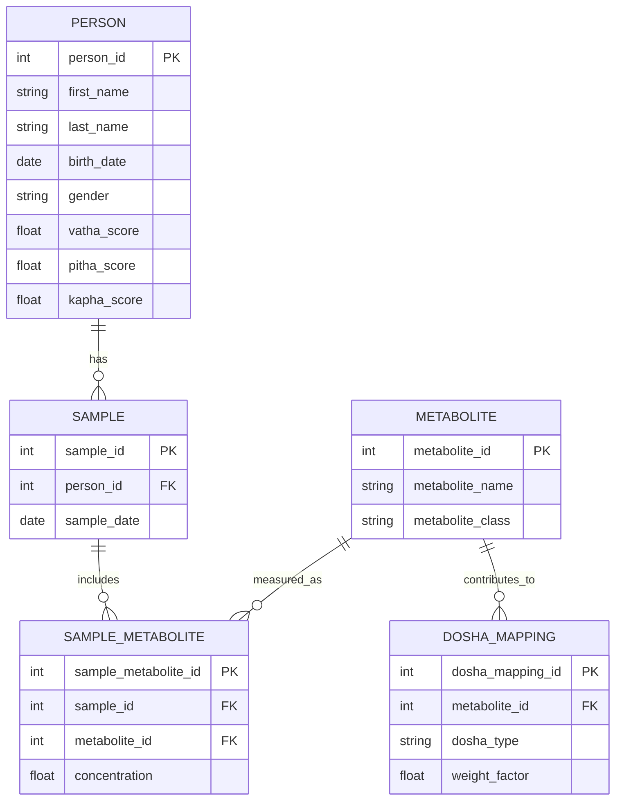

# Metabolomics Database Schema with Ayurvedic Principles

## Introduction

In Ayurveda, health is a state of perfect balance between three fundamental energies or **Doshas**:
- **Vatha** (air + ether): governs movement (breathing, circulation, nerve impulses).
- **Pitha** (fire + water): governs digestion, metabolism, and body temperature.
- **Kapha** (water + earth): governs structure, immunity, and lubrication.

Every person has a **unique balance** (Prakriti) of these Doshas.  
**Disease happens when this natural balance is disturbed** due to diet, lifestyle, emotions, environment, or aging.

> 🧐 **Key Principle**: Treat the imbalance, not just the symptoms.  
> Restore the body’s natural self-healing capacity by bringing Doshas back into harmony.

This is an attempt to design a relational database schema to store personalized metabolomics data and infer the personalized ayurvedic health profile for a given person.

---

# Designing a Suitable Relational Database Schema

## 1. ER Diagram (Metabolomics + Ayurvedic Principles)



## 2. Field Descriptions and Example Data

### PERSON Table
The `PERSON` table stores information about individuals in the study. The table includes dosha scores to track the Ayurvedic constitution of the person.

Note: `vatha_score`, `pitha_score` and `kapha_score` are initially NULL. (See Section **Personalized Dosha Updates based on a given a Sample**)

#### Example Data:

| person_id | first_name | last_name | birth_date | gender | vatha_score | pitha_score | kapha_score |
|-----------|------------|-----------|------------|--------|-------------|-------------|-------------|
| 1         | John       | Doe       | 1990-01-01 | Male   | 45.5        | 38.7        | 30.2        |
| 2         | Jane       | Smith     | 1985-02-10 | Female | 35.0        | 40.2        | 27.5        |
| 3         | Michael    | Brown     | 1992-07-22 | Male   | 50.1        | 30.0        | 29.3        |

### SAMPLE Table
The `SAMPLE` table stores sample information, including the person associated with the sample and the collection date.

#### Example Data:

| sample_id | person_id | sample_date |
|-----------|-----------|-------------|
| 1001      | 1         | 2024-04-01  |
| 1002      | 2         | 2024-04-05  |
| 1003      | 3         | 2024-04-10  |

### METABOLITE Table
The `METABOLITE` table stores information about metabolites, including their names and classifications.

#### Example Data:

| metabolite_id | metabolite_name | metabolite_class |
|---------------|-----------------|------------------|
| 501           | Glucose         | Sugar            |
| 502           | Cholesterol     | Lipid            |
| 503           | Creatinine      | Protein          |

### SAMPLE_METABOLITE Table
The `SAMPLE_METABOLITE` table links samples to metabolites, capturing the concentration of metabolites measured in each sample.

#### Example Data:

| sample_metabolite_id | sample_id | metabolite_id | concentration |
|----------------------|-----------|---------------|---------------|
| 10001                | 1001      | 501           | 5.6           |
| 10002                | 1002      | 502           | 4.2           |
| 10003                | 1003      | 503           | 3.1           |

### DOSHA_MAPPING Table
The `DOSHA_MAPPING` table maps metabolites to doshas, with a weight factor indicating how strongly each metabolite contributes to a particular dosha.

#### Example Data:

| dosha_mapping_id | metabolite_id | dosha_type | weight_factor |
|------------------|---------------|------------|---------------|
| 2001             | 501           | Vatha      | 0.8           |
| 2002             | 502           | Pitha      | 1.2           |
| 2003             | 503           | Kapha      | 0.5           |

## 3. Useful Queries

#### Select all dosha-related data for a person

```sql
SELECT
    p.first_name,
    p.last_name,
    p.vatha_score,
    p.pitha_score,
    p.kapha_score
FROM PERSON p
WHERE p.person_id = 1;
```

#### Get metabolite information for a specific sample

```sql
SELECT
    sm.concentration,
    m.metabolite_name,
    m.metabolite_class
FROM SAMPLE_METABOLITE sm
JOIN METABOLITE m ON sm.metabolite_id = m.metabolite_id
WHERE sm.sample_id = 1001;
```

---

# Personalized Dosha Updates based on a given a Sample

#### Example Python Code:
```python
import sqlite3

def update_dosha_scores(sample_id, db_path="metabolomics.db"):
    conn = sqlite3.connect(db_path)
    cursor = conn.cursor()

    query = """
        SELECT
            s.person_id,
            sm.concentration,
            dm.dosha_type,
            dm.weight_factor
        FROM SAMPLE_METABOLITE sm
        JOIN SAMPLE s ON sm.sample_id = s.sample_id
        JOIN DOSHA_MAPPING dm ON sm.metabolite_id = dm.metabolite_id
        WHERE sm.sample_id = ?
    """
    cursor.execute(query, (sample_id,))
    records = cursor.fetchall()

    if not records:
        print(f"No metabolite records found for sample_id {sample_id}.")
        return

    vatha_contribution = 0.0
    pitha_contribution = 0.0
    kapha_contribution = 0.0

    person_id = records[0][0]

    for rec in records:
        _, concentration, dosha_type, weight_factor = rec
        contribution = concentration * weight_factor

        if dosha_type == "Vatha":
            vatha_contribution += contribution
        elif dosha_type == "Pitha":
            pitha_contribution += contribution
        elif dosha_type == "Kapha":
            kapha_contribution += contribution

    update_query = """
        UPDATE PERSON
        SET
            vatha_score = COALESCE(vatha_score, 0) + ?,
            pitha_score = COALESCE(pitha_score, 0) + ?,
            kapha_score = COALESCE(kapha_score, 0) + ?
        WHERE person_id = ?
    """
    cursor.execute(update_query, (vatha_contribution, pitha_contribution, kapha_contribution, person_id))
    conn.commit()
    conn.close()

# Example usage:
update_dosha_scores(sample_id=1001)
```

---

# Personalized Prakriti Determination

#### Hypothetical Prakriti Rules

| Condition                                                 | Interpretation         |
|-----------------------------------------------------------|------------------------|
| Highest dosha > 40% and second-highest difference > 10%   | Single Dosha Dominant  |
| Two doshas > 30% and within 10% of each other             | Dual Dosha             |
| Otherwise                                                 | Tridoshic (balanced)   |

#### Example Python Code:

```python
percent_vatha = (vatha_score / (vatha_score + pitha_score + kapha_score)) * 100
percent_pitha = (pitha_score / (vatha_score + pitha_score + kapha_score)) * 100
percent_kapha = (kapha_score / (vatha_score + pitha_score + kapha_score)) * 100

# Sorts dosha percentages highest to lowest.
# dosha_list[0] will contain the Dosha with the highest percentage.
dosha_list = sorted(
    [('Vatha', percent_vatha), ('Pitha', percent_pitha), ('Kapha', percent_kapha)],
    key=lambda x: x[1],
    reverse=True
)

# Condition	                                                  Interpretation
# Highest dosha > 40% and second-highest difference > 10%	  Single Dosha Dominant
# Two doshas > 30% and within 10% of each other	              Dual Dosha
# Otherwise	                                                  Tridoshic (balanced)
if dosha_list[0][1] > 40 and (dosha_list[0][1] - dosha_list[1][1]) > 10:
    prakriti = f"{dosha_list[0][0]} dominant"
elif dosha_list[0][1] > 30 and dosha_list[1][1] > 30 and abs(dosha_list[0][1] - dosha_list[1][1]) < 10:
    prakriti = f"{dosha_list[0][0]}-{dosha_list[1][0]} dual"
else:
    prakriti = "Tridoshic (Vatha-Pitha-Kapha)"

```

# Time-series driven Personalized Prakriti Determination

Below is an alternative approach for `Personalized Prakriti Determination` by maintaining historical vatha, pitha, kapha values per each person over time.

#### Hypothetical Prakriti Rules

| Condition                                                 | Interpretation         |
|-----------------------------------------------------------|------------------------|
| Highest dosha > 40% and second-highest difference > 10%   | Single Dosha Dominant  |
| Two doshas > 30% and within 10% of each other             | Dual Dosha             |
| Otherwise                                                 | Tridoshic (balanced)   |

#### Example Python Code:

```python

def calculate_prakriti(time_series):
    # time_series: List of [timestamp, vatha, pitha, kapha]

    # Step 1: Organize by dosha
    vatha_scores = [v for _, v, _, _ in time_series]
    pitha_scores = [p for _, _, p, _ in time_series]
    kapha_scores = [k for _, _, _, k in time_series]

    # Step 2: Normalize
    def normalize(values):
        min_val, max_val = min(values), max(values)
        if max_val == min_val:
            return [0.5 for _ in values]  # Flat middle if no variation
        return [(v - min_val) / (max_val - min_val) for v in values]

    vatha_norm = normalize(vatha_scores)
    pitha_norm = normalize(pitha_scores)
    kapha_norm = normalize(kapha_scores)

    # Step 3: Moving average (window=3)
    def moving_average(values, window=3):
        smoothed = []
        for i in range(len(values)):
            window_vals = values[max(0, i - window + 1):i + 1]
            smoothed.append(sum(window_vals) / len(window_vals))
        return smoothed

    vatha_smooth = moving_average(vatha_norm)
    pitha_smooth = moving_average(pitha_norm)
    kapha_smooth = moving_average(kapha_norm)

    # Step 4: Mean values
    mean_vatha = sum(vatha_smooth) / len(vatha_smooth)
    mean_pitha = sum(pitha_smooth) / len(pitha_smooth)
    mean_kapha = sum(kapha_smooth) / len(kapha_smooth)

    # Step 5: Calculate percentages
    total = mean_vatha + mean_pitha + mean_kapha
    percent_vatha = (mean_vatha / total) * 100
    percent_pitha = (mean_pitha / total) * 100
    percent_kapha = (mean_kapha / total) * 100

    # Step 6: Decide Prakriti
    prakriti = ""
    dosha_list = sorted(
        [('Vatha', percent_vatha), ('Pitha', percent_pitha), ('Kapha', percent_kapha)],
        key=lambda x: x[1],
        reverse=True
    )

    if dosha_list[0][1] > 40 and (dosha_list[0][1] - dosha_list[1][1]) > 10:
        prakriti = f"{dosha_list[0][0]} dominant"
    elif dosha_list[0][1] > 30 and dosha_list[1][1] > 30 and abs(dosha_list[0][1] - dosha_list[1][1]) < 10:
        prakriti = f"{dosha_list[0][0]}-{dosha_list[1][0]} dual"
    else:
        prakriti = "Tridoshic (Vatha-Pitha-Kapha)"

    return {
        "mean_vatha": mean_vatha,
        "mean_pitha": mean_pitha,
        "mean_kapha": mean_kapha,
        "prakriti_type": prakriti,
        "percentages": {
            "Vatha": percent_vatha,
            "Pitha": percent_pitha,
            "Kapha": percent_kapha
        }
    }

```
